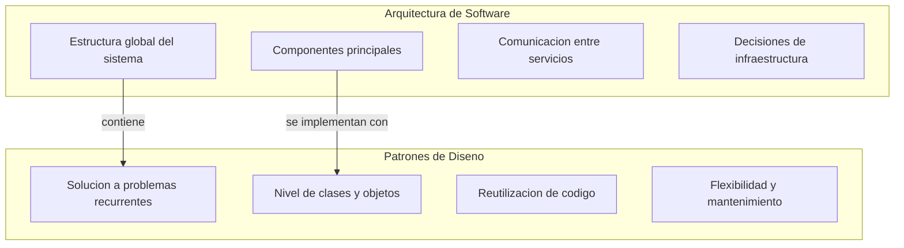
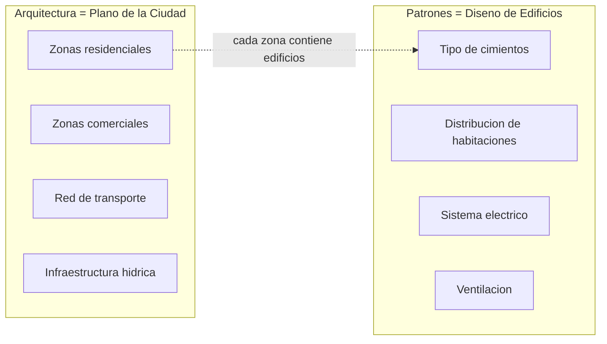
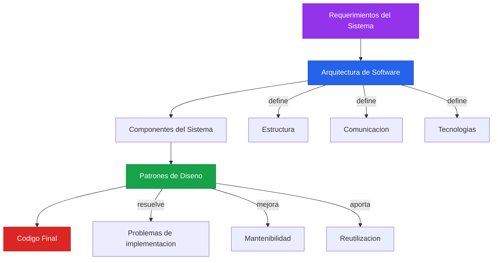
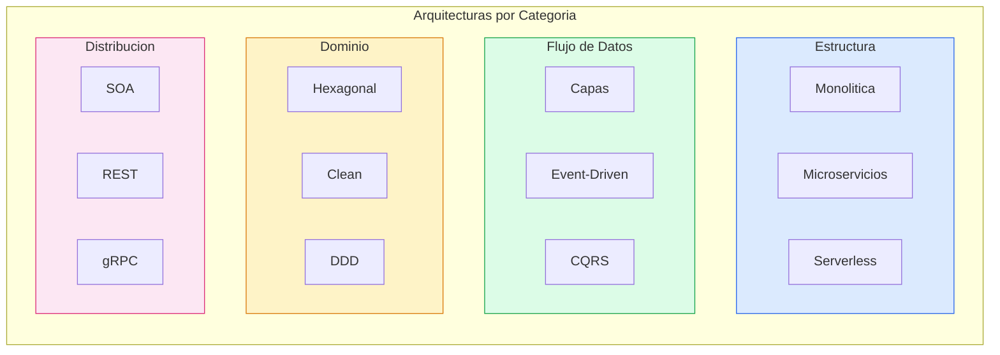
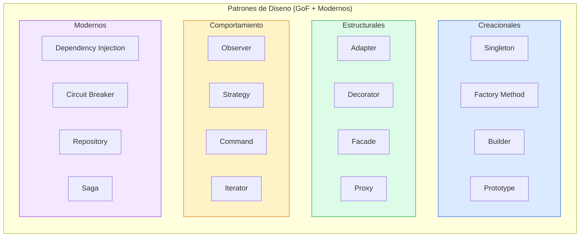
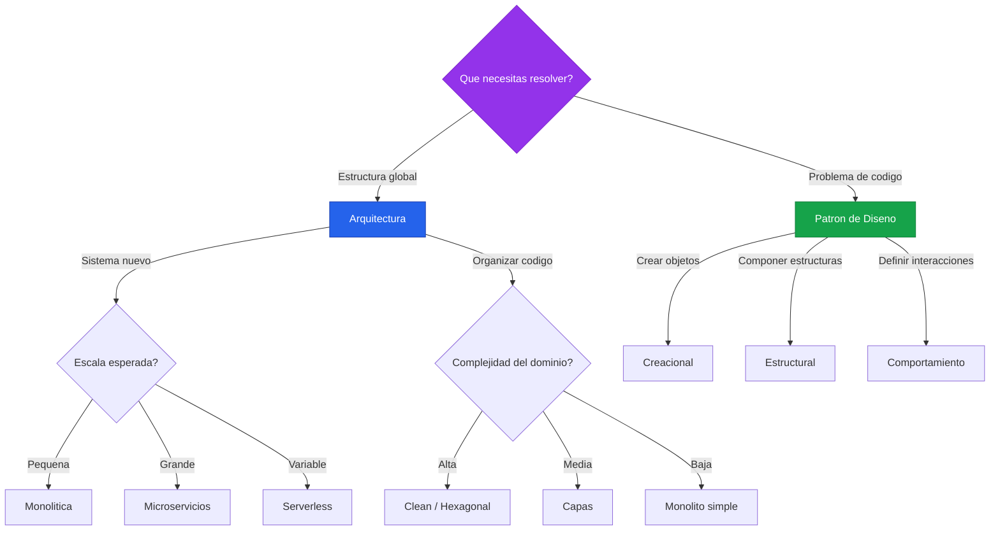

# Arquitectura de Software vs Patrones de Diseno

## Vision General

La **arquitectura de software** define la estructura global de un sistema, mientras que los **patrones de diseno** resuelven problemas recurrentes a nivel de codigo y componentes.

---

## Diferencias Clave

| Aspecto | Arquitectura de Software | Patrones de Diseno |
|---|---|---|
| **Alcance** | Sistema completo | Componente o clase |
| **Nivel de abstraccion** | Alto (macro) | Bajo-medio (micro) |
| **Quien decide** | Arquitecto de software | Desarrollador |
| **Momento** | Inicio del proyecto | Durante la implementacion |
| **Impacto de cambio** | Costoso y riesgoso | Localizado y manejable |
| **Objetivo** | Estructura y calidad global | Resolver problema especifico |
| **Ejemplo** | Microservicios | Singleton |

> [!NOTE]
> La arquitectura define **como se organizan los componentes** del sistema. Los patrones de diseno definen **como se implementan** esos componentes internamente.

---

## Analogia: Construir una Ciudad

> [!TIP]
> Piensa en la arquitectura como el **mapa general** y en los patrones como las **tecnicas de construccion** que usas dentro de cada edificio.

---

## Relacion entre Ambos

> [!IMPORTANT]
> La arquitectura y los patrones no compiten entre si. **La arquitectura establece el marco** y los **patrones se aplican dentro de ese marco** para resolver problemas concretos.

---

## Lista de Arquitecturas de Software

### Por Estructura

| # | Arquitectura | Descripcion |
|---|---|---|
| 1 | **Monolitica** | Toda la aplicacion en un unico desplegable |
| 2 | **Microservicios** | Servicios independientes con responsabilidad unica |
| 3 | **Modular (Modular Monolith)** | Monolito organizado en modulos desacoplados |
| 4 | **Serverless** | Funciones ejecutadas bajo demanda sin gestionar servidores |
| 5 | **Micro Frontends** | Frontend dividido en aplicaciones independientes |

### Por Flujo de Datos

| # | Arquitectura | Descripcion |
|---|---|---|
| 6 | **Capas (Layered / N-Tier)** | Separacion en capas: presentacion, logica, datos |
| 7 | **Pipes and Filters** | Datos fluyen a traves de filtros en secuencia |
| 8 | **Event-Driven** | Comunicacion mediante eventos asincronos |
| 9 | **CQRS** | Separacion de comandos (escritura) y consultas (lectura) |
| 10 | **Event Sourcing** | Estado derivado de una secuencia de eventos |

### Por Organizacion del Dominio

| # | Arquitectura | Descripcion |
|---|---|---|
| 11 | **Hexagonal (Ports & Adapters)** | Nucleo aislado del mundo exterior mediante puertos |
| 12 | **Clean Architecture** | Dependencias apuntan hacia el centro (dominio) |
| 13 | **Onion Architecture** | Capas concentricas con el dominio en el nucleo |
| 14 | **Domain-Driven Design (DDD)** | Modelado centrado en el dominio del negocio |
| 15 | **Vertical Slice** | Cada feature es un corte vertical completo del sistema |

### Por Comunicacion y Distribucion

| # | Arquitectura | Descripcion |
|---|---|---|
| 16 | **SOA (Service-Oriented)** | Servicios reutilizables comunicados por bus empresarial |
| 17 | **REST** | Comunicacion basada en recursos y verbos HTTP |
| 18 | **GraphQL** | API con consultas flexibles definidas por el cliente |
| 19 | **gRPC** | Comunicacion binaria de alto rendimiento entre servicios |
| 20 | **Message Queue** | Comunicacion asincrona mediante colas de mensajes |

### Otras

| # | Arquitectura | Descripcion |
|---|---|---|
| 21 | **Space-Based** | Procesamiento distribuido en memoria compartida |
| 22 | **Peer-to-Peer (P2P)** | Nodos iguales sin servidor central |
| 23 | **Plugin / Microkernel** | Nucleo minimo extensible mediante plugins |
| 24 | **Blackboard** | Multiples fuentes colaboran sobre un espacio de datos comun |
| 25 | **Cell-Based** | Sistema dividido en celulas autonomas y autocontenidas |

---

## Lista de Patrones de Diseno

### Creacionales (Creacion de objetos)

> [!NOTE]
> Los patrones creacionales abstraen el proceso de instanciacion, haciendo el sistema independiente de como se crean los objetos.

| # | Patron | Descripcion |
|---|---|---|
| 1 | **Singleton** | Una unica instancia global de una clase |
| 2 | **Factory Method** | Delega la creacion de objetos a subclases |
| 3 | **Abstract Factory** | Crea familias de objetos relacionados sin especificar clases concretas |
| 4 | **Builder** | Construye objetos complejos paso a paso |
| 5 | **Prototype** | Crea objetos clonando una instancia existente |
| 6 | **Object Pool** | Reutiliza objetos costosos de crear |

### Estructurales (Composicion de clases y objetos)

> [!NOTE]
> Los patrones estructurales se ocupan de como las clases y objetos se combinan para formar estructuras mas grandes.

| # | Patron | Descripcion |
|---|---|---|
| 7 | **Adapter** | Convierte la interfaz de una clase en otra esperada |
| 8 | **Bridge** | Separa abstraccion de implementacion |
| 9 | **Composite** | Trata objetos individuales y compuestos de forma uniforme |
| 10 | **Decorator** | Agrega responsabilidades a un objeto dinamicamente |
| 11 | **Facade** | Interfaz simplificada para un subsistema complejo |
| 12 | **Flyweight** | Comparte estado para soportar gran cantidad de objetos |
| 13 | **Proxy** | Representa a otro objeto controlando su acceso |

### Comportamiento (Comunicacion entre objetos)

> [!NOTE]
> Los patrones de comportamiento definen como los objetos interactuan y distribuyen responsabilidades.

| # | Patron | Descripcion |
|---|---|---|
| 14 | **Observer** | Notifica cambios de estado a multiples dependientes |
| 15 | **Strategy** | Intercambia algoritmos en tiempo de ejecucion |
| 16 | **Command** | Encapsula una solicitud como un objeto |
| 17 | **State** | Cambia el comportamiento segun el estado interno |
| 18 | **Template Method** | Define el esqueleto de un algoritmo, delegando pasos a subclases |
| 19 | **Iterator** | Recorre elementos de una coleccion sin exponer su estructura |
| 20 | **Mediator** | Centraliza la comunicacion entre objetos |
| 21 | **Chain of Responsibility** | Pasa una solicitud por una cadena de manejadores |
| 22 | **Visitor** | Agrega operaciones a objetos sin modificar sus clases |
| 23 | **Memento** | Captura y restaura el estado interno de un objeto |
| 24 | **Interpreter** | Define una gramatica y un interprete para un lenguaje |

### Patrones Modernos y de Aplicacion

| # | Patron | Descripcion |
|---|---|---|
| 25 | **Repository** | Abstrae el acceso a datos como una coleccion en memoria |
| 26 | **Unit of Work** | Agrupa operaciones de persistencia en una transaccion |
| 27 | **Dependency Injection** | Inyecta dependencias desde el exterior |
| 28 | **Circuit Breaker** | Evita llamadas a servicios que estan fallando |
| 29 | **Retry** | Reintenta operaciones fallidas con backoff |
| 30 | **Saga** | Coordina transacciones distribuidas entre servicios |

---

## Cuando Usar Cada Uno

> [!WARNING]
> No elijas una arquitectura o patron solo porque es popular. Analiza los **requerimientos reales** de tu proyecto: escala, equipo, complejidad del dominio y restricciones tecnicas.

---

## Resumen Final

> [!IMPORTANT]
> **Arquitectura** = decisiones estrategicas sobre la estructura del sistema (dificiles de cambiar).
> **Patrones de Diseno** = tacticas reutilizables para resolver problemas de implementacion (faciles de aplicar y cambiar).
>
> Ambos son complementarios: una buena arquitectura necesita buenos patrones, y los mejores patrones sin arquitectura llevan al caos.
