---
tags:
  - area/lite
  - tipo/nota
---

# Reto 1 — Arquitectura Evolutiva: FlashSale

> [!NOTE]
> **Plataforma**: FlashSale — e-commerce de **ventas relámpago** (promos de 10–30 minutos).
> **Horizonte**: 18–24 meses, de startup a producto consolidado.
> **Características críticas**: picos extremos de tráfico, inventario en tiempo real, latencia baja en checkout, alta consistencia en stock.

---

## 0. Contexto del Reto

FlashSale arranca como una startup pequeña con un equipo reducido y un MVP funcional. Durante 18–24 meses crece en:

- **Usuarios concurrentes**: de cientos a cientos de miles durante una flash sale.
- **Catálogo**: de decenas a miles de SKUs.
- **Tráfico**: picos de 100x el promedio durante eventos.
- **Equipos**: de 3 a 30+ ingenieros, organizados por bounded context.

> [!IMPORTANT]
> El reto NO es construir el sistema "ideal" de día uno. Es **diseñar la evolución** que acompaña al negocio sin sobrediseñar al inicio ni quedar atrapados después.

La arquitectura se modela en **cuatro momentos**:

| Momento | Ventana | Foco | Estilo dominante |
| --- | --- | --- | --- |
| **M1** | Mes 0–2 | Validar el negocio | **Monolito modular en capas** |
| **M2** | Mes 3–6 | Aguantar los primeros picos | **N-Tier distribuido + Worker Tier** |
| **M3** | Mes 6–12 | Romper el monolito | **Microservicios por Bounded Context, event-driven** |
| **M4** | Mes 12–24 | Escala global y resiliencia | **Cell-Based + Multi-Región + Event Mesh** |

> [!TIP]
> **Plantilla por momento** (todos siguen la misma estructura):
> 1. Diagrama Mermaid
> 2. Problema principal
> 3. Estilo arquitectónico elegido
> 4. Patrones por zonas (Edge · Aplicación · Datos · Asíncrono · Resiliencia · Observabilidad · Operación)
> 5. Decisiones de datos y resiliencia
> 6. Cómo migrar al siguiente momento sin "big bang"

---

## 1. Momento 1 — MVP Monolito Modular (Mes 0–2)

### 1.1 Diagrama

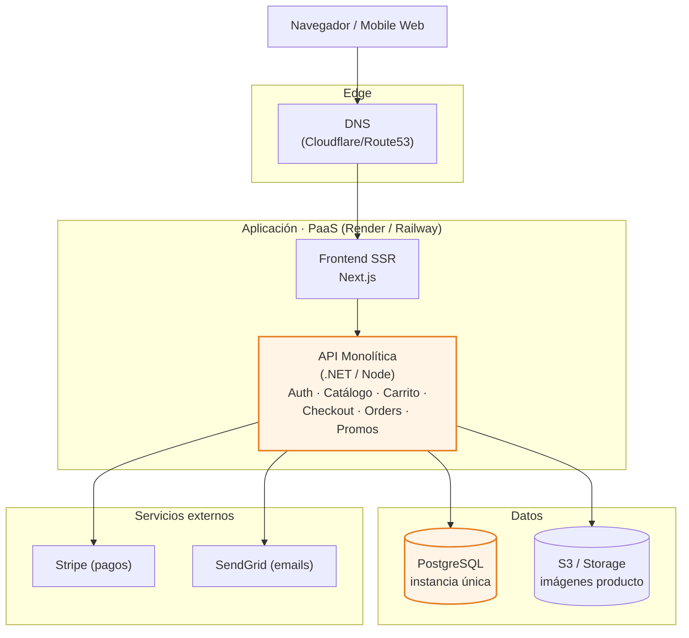

### 1.2 Problema principal

> [!WARNING]
> **No sabemos si el producto le importa a alguien.**
> El riesgo número uno NO es la escala, es **construir algo que nadie quiere**.

- Equipo de 3 personas, presupuesto cero para infra.
- Necesidad de iterar el modelo de negocio en días, no en sprints.
- Cualquier complejidad operativa (Kubernetes, microservicios, colas) **roba tiempo** del único objetivo real: validar el producto.

### 1.3 Estilo arquitectónico

**Monolito modular en capas** (Layered Architecture).

- Una sola unidad desplegable.
- Separación interna estricta: `Presentation → Application → Domain → Infrastructure`.
- Dependencias hacia adentro: el dominio NO conoce frameworks.

> [!TIP]
> **Modular** es la palabra clave. Un monolito mal hecho ata las manos cuando toca dividir. Un monolito modular se rompe en pedazos limpios cuando llega el momento.

### 1.4 Patrones por zonas

| Zona | Patrones |
| --- | --- |
| **Edge** | DNS plano, TLS terminator del PaaS |
| **Aplicación** | Layered Architecture, Dependency Injection, Repository, Unit of Work |
| **Datos** | ORM (EF Core / Prisma), transacciones ACID locales, migraciones versionadas |
| **Asíncrono** | Ninguno todavía (todo síncrono) |
| **Resiliencia** | Timeouts en clientes HTTP, reintento simple en pagos |
| **Observabilidad** | Logs estructurados a stdout, captura de errores (Sentry) |
| **Operación** | Deploy automático desde `main`, migraciones en el arranque |

### 1.5 Decisiones de datos y resiliencia

| Decisión | Justificación | Trade-off aceptado |
| --- | --- | --- |
| Postgres único, sin réplicas | Sin tráfico que justifique réplica | SPOF de datos |
| Inventario con `SELECT FOR UPDATE` | Suficiente para 50 órdenes/min | No escala a flash sales reales |
| Cache: ninguno | YAGNI | DB sufrirá ante el primer pico |
| Pagos delegados a Stripe | Evita compliance PCI | Dependencia externa fuerte |
| Sin cola de mensajes | Simplicidad | Emails bloquean el request |
| Backups diarios automáticos | Mínimo viable de DR | RPO de 24h |

### 1.6 Migración a M2 sin big-bang

> [!IMPORTANT]
> Regla de oro: **el monolito no se reescribe**. Se rodea de infraestructura nueva.

| Paso | Estrategia | Riesgo |
| --- | --- | --- |
| 1. Contenerizar el monolito | Dockerfile multi-stage, mismo binario | Bajo — el código no cambia |
| 2. Agregar load balancer | Levantar 2 réplicas detrás de ALB | Bajo — sticky sessions si hace falta |
| 3. Introducir Redis con cache-aside | Decorator alrededor del repositorio de catálogo | Medio — invalidación |
| 4. Read replica de Postgres | Routing de lecturas en el `DbContext` | Medio — replication lag |
| 5. Externalizar emails a cola | **Branch-by-abstraction**: interfaz `INotifier` con dos implementaciones (sync legacy / async cola) detrás de feature flag | Bajo — toggle reversible |
| 6. CDN delante de estáticos | Cambio de DNS, sin tocar código | Bajo |

> [!TIP]
> **Cada paso es reversible y se prueba en producción con feature flags.** Nada se rompe en una sola noche.

---

## 2. Momento 2 — Monolito Endurecido + Worker Tier (Mes 3–6)

### 2.1 Diagrama

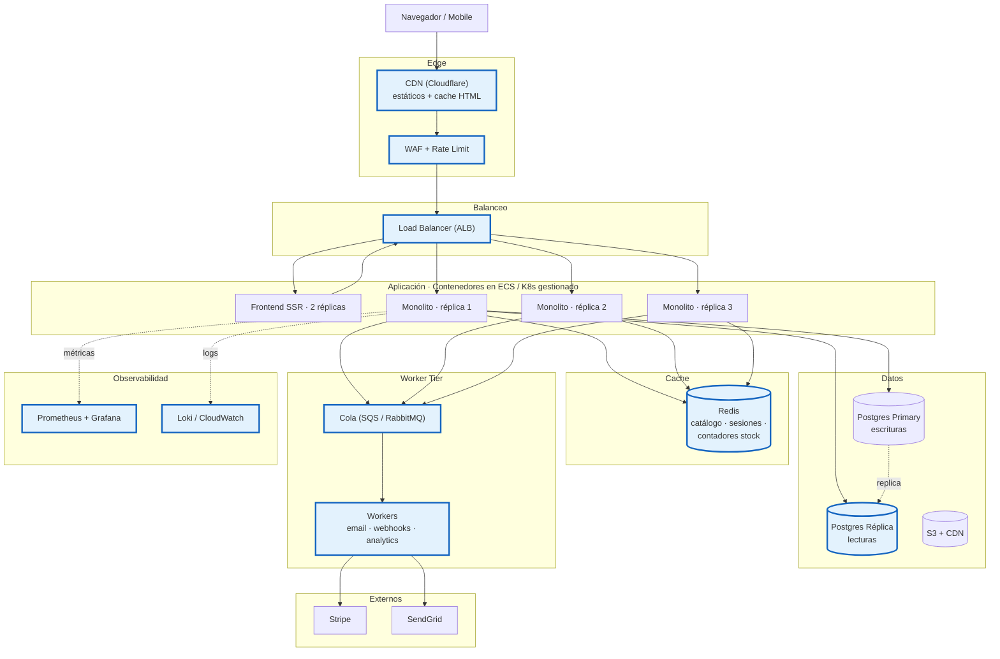

### 2.2 Problema principal

> [!WARNING]
> **El primer pico real rompió el MVP.**
> La DB se ahogó, los emails colapsaron el checkout, una caída tiró TODO el sitio.

- Sigue siendo un único deployable, pero ya no podemos permitirnos que se caiga.
- Las flash sales generan picos de lectura 50–100x sobre el promedio.
- Los procesos lentos (emails, webhooks, analytics) ya no pueden vivir en el request.

### 2.3 Estilo arquitectónico

**N-Tier distribuido + Worker Tier asíncrono.**

- El monolito se replica horizontalmente detrás de un balanceador.
- Aparece una **segunda capa de cómputo asíncrona**: workers consumiendo una cola.
- Aparece una **capa de cache distribuida** que se interpone entre la aplicación y la DB.

> [!TIP]
> Seguimos siendo *un solo proyecto de código*, pero ya somos **varios procesos cooperando**. Es el primer paso hacia un sistema distribuido.

### 2.4 Patrones por zonas

| Zona | Patrones |
| --- | --- |
| **Edge** | CDN, WAF, Rate Limiting, Bot Protection, TLS termination |
| **Aplicación** | Stateless replicas, Health Probes (`/health`, `/ready`), Graceful Shutdown, BFF embrionario, Feature Flags |
| **Datos** | **Cache-Aside**, **Read/Write Splitting**, Connection Pooling, Migraciones versionadas, **Outbox embrionario** para emails críticos |
| **Asíncrono** | **Producer/Consumer**, **Competing Consumers**, **Idempotent Consumer**, Dead Letter Queue básica |
| **Resiliencia** | **Circuit Breaker** (Polly / resilience4j), **Retry con backoff exponencial**, **Bulkhead** entre integraciones externas, **Timeout** explícito por dependencia |
| **Observabilidad** | Métricas RED (Rate / Errors / Duration), Logs estructurados con `correlation-id`, Alertas básicas, Dashboards por servicio |
| **Operación** | IaC (Terraform), Pipelines CI/CD por entorno, Blue-Green deploy del monolito, Backups y PITR de Postgres |

### 2.5 Decisiones de datos y resiliencia

| Decisión | Justificación | Trade-off aceptado |
| --- | --- | --- |
| Postgres Primary + Read Replica | Lecturas calientes (catálogo, reportes) ahogaban writes | Replication lag visible (~100ms) |
| Redis para cache + sesiones | Sesiones fuera del proceso → réplicas stateless | Invalidez si la cache se cae (degradado, no caído) |
| Contadores de stock en Redis (counter pattern) | Reduce contención sobre la fila de inventario | Reconciliación periódica con DB |
| Cola para emails y webhooks | Saca de la ruta crítica del checkout | Consistencia eventual visible al usuario |
| Outbox para eventos críticos | Garantiza "publica si y solo si commitea" | Tabla extra y proceso relay |
| Circuit breaker en Stripe / SendGrid | Una caída externa NO debe tirar el sitio | Errores degradados al usuario |
| Multi-AZ en Postgres y Redis | Alta disponibilidad de datos | Costo ~2x |
| Backups continuos + PITR | RPO < 5 min | Más espacio de almacenamiento |

### 2.6 Migración a M3 sin big-bang

> [!IMPORTANT]
> Acá entra el patrón estrella de evolución de monolitos: **Strangler Fig**. Se construye lo nuevo *al lado* y se redirige el tráfico gradualmente.

| Paso | Estrategia | Riesgo |
| --- | --- | --- |
| 1. Definir bounded contexts | Event Storming con producto y negocio | Bajo — es análisis |
| 2. Introducir API Gateway | Mismo monolito detrás. El gateway pasa a ser el único punto de entrada | Medio — punto único nuevo, requiere HA |
| 3. Extraer **`svc-notifications`** primero | Servicio de menor riesgo, ya consume la cola que construimos en M2 | Bajo — el monolito deja de saber de SendGrid |
| 4. Extraer **`svc-inventory`** | Crítico, pero el más doloroso → mayor ROI. Usar **dual-write con shadow reads** durante 2 semanas | Alto — requiere paridad medida |
| 5. Introducir **Kafka** como event backbone | El monolito empieza a publicar eventos por **CDC (Change Data Capture)** desde la outbox | Medio — operativo |
| 6. Extraer **`svc-catalog`** con CQRS | Read model en OpenSearch alimentado por eventos. Escrituras siguen en el monolito hasta paridad | Medio |
| 7. El monolito se reduce sprint a sprint | Cada bounded context extraído es un PR de **eliminación neta de código** | Bajo si los pasos previos están sanos |

> [!TIP]
> **Shadow traffic + dual-write** es la red de seguridad: lo nuevo recibe el mismo tráfico que lo viejo, comparamos resultados, y solo cuando hay paridad medida durante días, se corta lo viejo.

---

## 3. Momento 3 — Microservicios por Bounded Context (Mes 6–12)

### 3.1 Diagrama

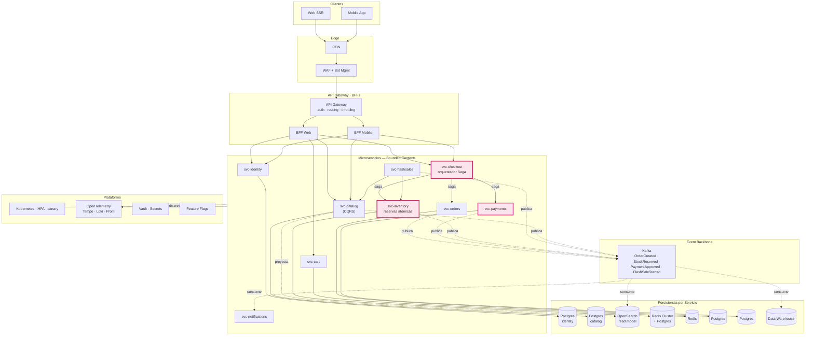

### 3.2 Problema principal

> [!WARNING]
> **El monolito ya no es el cuello técnico — es el cuello *organizacional*.**
> Tres equipos pisándose en el mismo repo. Un bug en pagos tira catálogo. Un deploy implica 200 PRs en una rama.

- 8–15 ingenieros, divididos en squads por dominio.
- Inventario y promociones tienen **patrones de carga radicalmente distintos** al resto.
- El negocio quiere experimentar con flash sales más complejas y no puede esperar al ciclo de release del monolito.

### 3.3 Estilo arquitectónico

**Microservicios por Bounded Context + Event-Driven Architecture.**

- Un servicio = un equipo = un repo = un pipeline = una base de datos.
- Comunicación primaria **asíncrona vía eventos** (Kafka).
- Comunicación síncrona **solo donde el negocio lo exige** (BFF → servicios, saga).
- **Database per Service**: cada servicio dueño absoluto de su esquema.

> [!IMPORTANT]
> Esto **NO** es "todo microservicios porque sí". Cada extracción se justifica con un dolor medido en M2: el servicio extraído debe tener un patrón de carga, ciclo de vida o equipo distinto del resto.

### 3.4 Patrones por zonas

| Zona | Patrones |
| --- | --- |
| **Edge** | CDN, WAF, **API Gateway** (auth, throttling, routing), **BFF por canal** (web/mobile) |
| **Aplicación** | **Saga orquestada** (checkout), **Domain-Driven Design**, **Anti-Corruption Layer** entre servicios y legados, Feature Flags por servicio |
| **Datos** | **Database per Service**, **CQRS** (catálogo), **Event Sourcing parcial** (orders), **Materialized Views** (read models en OpenSearch), **CDC** desde DBs hacia eventos |
| **Asíncrono** | **Event Broker** (Kafka), **Outbox Pattern**, **Idempotency Keys**, **Dead Letter Topics**, **Schema Registry** (Avro / Protobuf), **Event Versioning** |
| **Resiliencia** | **Bulkhead por servicio**, **Circuit Breaker** entre servicios, **Saga compensaciones**, **Retry + DLQ**, **Timeout en cada llamada inter-servicio**, **Graceful degradation** (catálogo cacheado si svc-catalog cae) |
| **Observabilidad** | **OpenTelemetry**: tracing distribuido (Tempo/Jaeger), métricas (Prometheus), logs (Loki), correlation-id end-to-end, **SLOs por servicio**, error budgets |
| **Operación** | **Kubernetes** multi-AZ, **HPA**, **canary deploys**, **GitOps** (ArgoCD), **Service Mesh** (mTLS, retries, timeouts), **Vault** para secrets |

### 3.5 Decisiones de datos y resiliencia

| Decisión | Justificación | Trade-off aceptado |
| --- | --- | --- |
| **Database per service** | Acoplamiento por DB compartida es la peor cárcel | Joins cross-service vía API o event projections |
| **Inventario en Redis Cluster con reservas atómicas + TTL** | Lock contention en Postgres no escala a 50k ord/min | Reconciliación con Postgres como source of truth eventual |
| **CQRS en catálogo** (writes Postgres → reads OpenSearch) | Lecturas son 100x escrituras | Lag de proyección visible (~1–2s) |
| **Saga orquestada en checkout** | Transacciones distribuidas sin 2PC | Lógica de compensación explícita y testeable |
| **Outbox + Debezium** para publicación | Garantiza al-menos-una-vez sin perder eventos | Más infra (Kafka Connect) |
| **Idempotency keys** en pagos y orders | Reintentos seguros en colas | Tabla extra de claves consumidas |
| **Bulkheading**: pools de threads/conexiones por integración | Una caída de Stripe NO arrastra el resto | Más ajuste fino de capacidad |
| **SLO 99.9%** por servicio crítico | Error budget medible y accionable | Cultura de alertas basadas en SLO, no en CPU |
| **Backup + restore probado mensualmente** | DR real, no sólo declarativo | Costo operativo |

### 3.6 Migración a M4 sin big-bang

> [!IMPORTANT]
> El salto a M4 NO reescribe servicios. Cambia el **patrón de despliegue y aislamiento** de los servicios que ya tenemos.

| Paso | Estrategia | Riesgo |
| --- | --- | --- |
| 1. Identificar **hot path** (flash sales) y **cold path** (resto) | Análisis de carga real por endpoint | Bajo |
| 2. Definir el concepto de **célula** (cell) | Una célula = stack completo aislado para un subconjunto de usuarios o eventos | Medio — diseño |
| 3. Levantar **una célula piloto** | Mismo código, mismo Helm chart, distinto namespace + datos aislados | Medio |
| 4. **Shuffle sharding** | Routear usuarios a celdas vía hash en el API Gateway | Medio — sticky a nivel cell |
| 5. Extender a **multi-región** activa-pasiva primero, luego activa-activa | Data residency, replicación cross-region de Kafka (MirrorMaker) | Alto — consistencia cross-region |
| 6. **Chaos engineering** continuo | Game days, ejercicios de cell failover | Medio |
| 7. Migración progresiva de usuarios | 1% → 10% → 50% → 100% por celda, con rollback automático por SLO | Bajo si los pasos anteriores se hicieron |

> [!TIP]
> El paradigma cambia: en M3 hablamos de "deployar un servicio". En M4 hablamos de "deployar una célula completa". El servicio individual es la unidad de código; la célula es la unidad de **falla y escala**.

---

## 4. Momento 4 — Plataforma Cell-Based + Multi-Región (Mes 12–24)

### 4.1 Diagrama

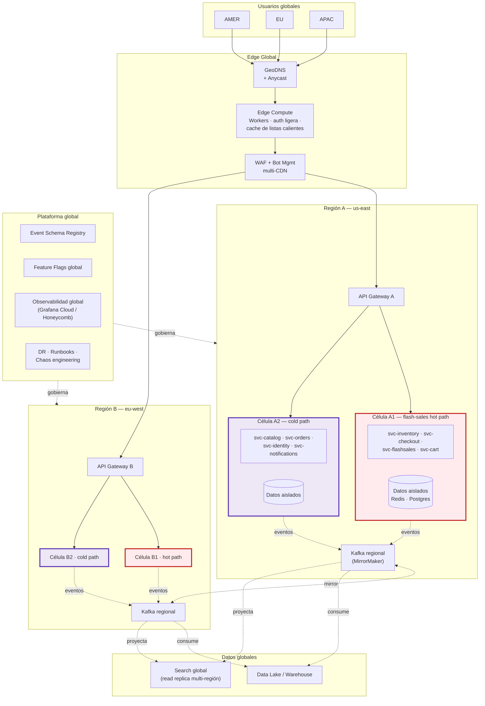

### 4.2 Problema principal

> [!WARNING]
> **Los modos de falla ya no son técnicos individuales — son sistémicos.**
> Una flash sale viral colapsa la región completa. Una latencia transatlántica arruina el checkout de un usuario en Tokio. Un cambio de schema mal coordinado tira tres servicios a la vez.

- 30+ ingenieros en múltiples zonas horarias.
- SLA contractuales: 99.95% disponibilidad mensual.
- Picos de 50.000+ órdenes/minuto durante eventos.
- Necesidad de **aislamiento de fallas**: que un cliente catastrófico no afecte a los demás.
- Compliance: residencia de datos por región (GDPR, etc.).

### 4.3 Estilo arquitectónico

**Cell-Based Architecture + Multi-Región Active-Active + Event Mesh global.**

- Cada **célula** es un stack completo (servicios + datos + colas) que sirve a un subconjunto bien definido de usuarios.
- **Shuffle sharding**: usuarios distribuidos entre celdas de forma que la falla de una afecta a una minoría.
- **Hot path / cold path**: las celdas que sirven flash sales están optimizadas y aisladas de las que sirven el resto.
- Despliegues **multi-región activa-activa** con replicación de eventos cross-region.
- El **Event Mesh** se vuelve la columna vertebral: contratos de eventos versionados, registry global, retención larga.

> [!TIP]
> En M4 ya no diseñás *servicios*: diseñás **modos de falla**. La pregunta no es "¿qué pasa si este servicio se cae?", sino "¿qué pasa si se cae una región / una célula / el evento se procesa dos veces / hay 3 segundos de partición de red?".

### 4.4 Patrones por zonas

| Zona | Patrones |
| --- | --- |
| **Edge** | **GeoDNS + Anycast**, **Edge Compute** (Cloudflare Workers / Lambda@Edge), **Multi-CDN failover**, WAF global con reputación cruzada, **Origin shielding** |
| **Aplicación** | **Cell-based isolation**, **Shuffle sharding**, **Hot/Cold path separation**, **Throttling cooperativo** entre celdas, **Cell controller** (control plane que orquesta celdas) |
| **Datos** | **Sharding por celda**, **Read replicas multi-región**, **Active-active** para datos no-críticos, **Active-passive con failover < 60s** para críticos, **Event store global** con retención larga, **Immutable infra** |
| **Asíncrono** | **Event Mesh** (Kafka federado o Confluent Cloud), **MirrorMaker / Cluster Linking** entre regiones, **Schema Registry** versionado, **Event versioning con compatibilidad** (forward/backward), **Idempotencia obligatoria** |
| **Resiliencia** | **Cell failover automático**, **Region failover ensayado**, **Chaos engineering continuo** (Gremlin / propio), **Game days** trimestrales, **Load shedding** en el edge, **Adaptive concurrency** |
| **Observabilidad** | Tracing distribuido cross-region, **SLO multi-nivel** (servicio · célula · región · global), **Error budget policies**, **Anomaly detection** sobre métricas, **Continuous profiling** |
| **Operación** | **GitOps multi-cluster** (ArgoCD ApplicationSets), **Progressive delivery** (Argo Rollouts: canary, blue-green, automatic rollback por SLO), **FinOps** integrado, **Runbooks automatizados** |

### 4.5 Decisiones de datos y resiliencia

| Decisión | Justificación | Trade-off aceptado |
| --- | --- | --- |
| **Cell-based isolation** | El blast radius de cualquier falla queda contenido en una célula | Más complejidad operativa, costo extra |
| **Shuffle sharding** | Probabilidad de que dos clientes ruidosos compartan celda → casi cero | Routing más complejo en el gateway |
| **Active-active multi-región** para lecturas | Latencia cercana al usuario | Consistencia eventual cross-region |
| **Active-passive** para escrituras críticas (pagos, órdenes) | Single source of truth por región | Failover medible (~30–60s) |
| **Hot path dedicado para flash sales** | Las celdas hot path se pre-warmean antes de cada evento | Recursos reservados |
| **Event versioning estricto** | Schema breaking changes son el peor enemigo del event-driven | Disciplina de contratos |
| **Chaos engineering en producción** | El sistema se prueba en su modo real | Cultura de game days |
| **DR ensayado mensualmente** | RTO/RPO declarado debe ser RTO/RPO probado | Tiempo de equipo |
| **Replicación de Kafka cross-region** | Eventos sobreviven a la pérdida de una región | Latencia y costo de bandwidth |
| **Encryption at-rest + in-transit en todo lado** | Compliance no negociable | Overhead mínimo medido |

### 4.6 ¿Y después? Migración continua sin big-bang

> [!IMPORTANT]
> Acá ya no hay "siguiente momento". Hay **evolución continua**.
> El sistema se vuelve un organismo: cada cambio entra por canary, cada feature por flag, cada region por activa-pasiva-activa.

| Capacidad operativa | Estado en M4 |
| --- | --- |
| Despliegues por servicio | Decenas por día, automáticos |
| Roll-back ante violación de SLO | Automático en minutos |
| Nueva región productiva | Días, no meses |
| Nueva celda (capacidad extra) | Horas |
| Refactor mayor de un servicio | Strangler fig dentro de la célula, sin afectar el resto |
| Cambio de schema de evento | Versionado backward-compatible obligatorio |

> [!TIP]
> A partir de acá, el "siguiente momento" se decide por necesidad concreta del negocio: ¿plataforma para sellers externos? ¿Marketplace? ¿Mobile-first en mercados emergentes? Cada uno demanda extender el modelo, no reemplazarlo.

---

## 5. Tabla Resumen de la Evolución

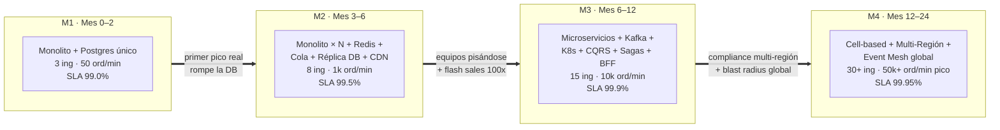

| Aspecto | M1 | M2 | M3 | M4 |
| --- | --- | --- | --- | --- |
| **Estilo** | Monolito modular | N-Tier + Worker Tier | Microservicios + Event-Driven | Cell-Based + Multi-Región |
| **Unidad de despliegue** | App entera | App replicada | Servicio | Célula completa |
| **Datos** | Postgres único | Primary + Réplica + Redis | DB per service + Read models | Sharding + multi-región |
| **Comunicación** | In-process | HTTP + Cola | Eventos Kafka + HTTP saga | Event Mesh + Edge compute |
| **Resiliencia** | Timeouts | Circuit breaker + Retry | Sagas + Bulkhead + DLQ | Cell isolation + Chaos |
| **Observabilidad** | Logs + Sentry | Métricas RED + Logs | OpenTelemetry + SLOs | SLOs multi-nivel + anomaly |
| **Operación** | PaaS | IaC + Blue-Green | GitOps + Service Mesh | GitOps multi-cluster + Progressive delivery |
| **Equipo** | 3 | 5–8 | 8–15 | 30+ |
| **Capacidad** | 50 ord/min | 1.000 ord/min | 10.000 ord/min | 50.000+ ord/min pico |
| **Disponibilidad** | 99.0% | 99.5% | 99.9% | 99.95% |
| **Recovery (MTTR)** | Horas | 30–60 min | < 10 min | < 5 min, automático |

---

## 6. Mapa de Migraciones sin Big-Bang

> [!IMPORTANT]
> Toda la evolución se sostiene con **cinco patrones de migración**. Internalizá estos cinco y nunca más necesitás un big bang.

| Patrón | Cuándo usarlo | Ejemplo en este reto |
| --- | --- | --- |
| **Branch-by-Abstraction** | Cuando hay que cambiar una implementación interna sin tocar callers | Reemplazar emails síncronos por cola en M1→M2 |
| **Strangler Fig** | Cuando hay que reemplazar un sistema completo gradualmente | Extraer servicios del monolito en M2→M3 |
| **Dual-Write + Shadow Reads** | Cuando hay que migrar un store de datos crítico | Migrar inventario de Postgres a Redis Cluster en M3 |
| **Feature Flags + Canary** | Cuando hay que activar comportamiento nuevo de forma reversible | Cualquier feature de negocio en M2/M3/M4 |
| **Cell Migration** | Cuando hay que mover usuarios entre stacks aislados | Roll-out de M3→M4, célula por célula |

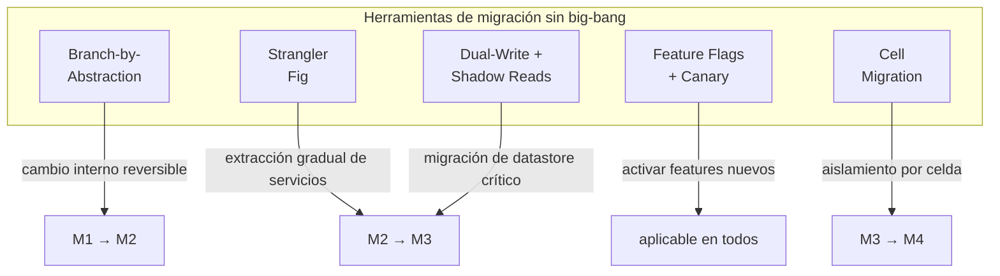

---

## 7. Architecture Decision Records (ADRs)

> [!IMPORTANT]
> Un ADR documenta **una decisión arquitectónica con su contexto y consecuencias**. Vive con el código (carpeta `/docs/adr/`), se versiona, y nunca se borra: si una decisión cambia, se crea un nuevo ADR con `Status: Superseded by ADR-NNN`.

**Formato estándar**: ID · Título · Status · Contexto · Decisión · Consecuencias (positivas / negativas) · Momento.

---

### ADR-001 — Empezar con monolito modular en lugar de microservicios

| Campo | Valor |
| --- | --- |
| **Status** | Accepted |
| **Momento** | M1 |

**Contexto**. Equipo de 3 ingenieros, producto sin validar, presupuesto de infra mínimo. La industria empuja el discurso de "microservicios desde el día uno", pero el costo operativo (infra distribuida, observabilidad, on-call) es prohibitivo a esta escala.

**Decisión**. Construir un **monolito modular** con separación interna estricta de capas (`Presentation → Application → Domain → Infrastructure`). El dominio NO depende de frameworks. Bounded contexts identificados como **módulos internos**, no como servicios.

**Consecuencias positivas**:
- Velocidad máxima de entrega.
- Transacciones ACID locales sin coordinación distribuida.
- Debug y refactor triviales.
- Cuando llegue el momento de extraer servicios, los módulos internos son las costuras naturales.

**Consecuencias negativas**:
- Una caída tira todo el sitio.
- Deploys monolíticos: cualquier cambio implica desplegar todo.
- Riesgo de erosión modular si la disciplina interna se afloja.

---

### ADR-002 — Cache-Aside con Redis para catálogo y sesiones

| Campo | Valor |
| --- | --- |
| **Status** | Accepted |
| **Momento** | M2 |

**Contexto**. La primera flash sale real saturó la DB con lecturas de catálogo. Las sesiones en memoria del proceso impiden replicar el monolito horizontalmente.

**Decisión**. Introducir **Redis** como cache distribuida con patrón **Cache-Aside**:
1. La aplicación consulta Redis primero.
2. Si miss → consulta Postgres → escribe en Redis con TTL.
3. Las invalidaciones se hacen al escribir en el repositorio (write-through opcional para entidades críticas).

Redis también almacena **sesiones**, permitiendo que las réplicas del monolito sean stateless.

**Consecuencias positivas**:
- Lecturas de catálogo bajan de ~80ms a ~3ms p95.
- DB libera CPU para escrituras.
- Réplicas stateless → escalado horizontal trivial.

**Consecuencias negativas**:
- Riesgo de servir datos stale si la invalidación falla.
- Si Redis cae → modo degradado: la app cae a Postgres directo (debe estar testeado).
- Costo extra de infra (~USD 50/mes inicial).

---

### ADR-003 — Outbox Pattern para publicación de eventos críticos

| Campo | Valor |
| --- | --- |
| **Status** | Accepted |
| **Momento** | M2 (embrionario), M3 (consolidado) |

**Contexto**. Necesitamos publicar eventos a una cola/broker **garantizando** que el evento se publica **si y solo si** la transacción de la DB hace commit. Publicar antes del commit puede emitir eventos fantasma; publicar después puede perder eventos si el proceso muere entre commit y publicación.

**Decisión**. Implementar **Outbox Pattern**:
1. La transacción que muta el estado de negocio escribe **también** una fila en la tabla `outbox` (mismo commit ACID).
2. Un proceso relay (en M2 un job; en M3 Debezium/CDC) lee la `outbox` y publica al broker.
3. Marca como publicado o usa offset.

**Consecuencias positivas**:
- Garantía at-least-once sin perder mensajes.
- Sobrevive a caídas del proceso entre commit y publicación.
- Permite reproyectar eventos relisteando la outbox.

**Consecuencias negativas**:
- Tabla `outbox` extra a mantener (cleanup, índices).
- Latencia de publicación: 100ms–2s típico.
- Los consumidores **deben** ser idempotentes (mismo evento puede llegar dos veces).

---

### ADR-004 — Database per Service en microservicios

| Campo | Valor |
| --- | --- |
| **Status** | Accepted |
| **Momento** | M3 |

**Contexto**. La mayor cárcel de un sistema "microservicios" es una **base de datos compartida**: cualquier cambio de schema rompe múltiples servicios, los joins multi-dominio invitan a violar bounded contexts, y un servicio ruidoso afecta a los demás.

**Decisión**. Cada servicio es **dueño absoluto** de su esquema. Ningún servicio lee la DB de otro. La comunicación entre dominios es vía **API** (síncrono) o **eventos** (asíncrono).

**Consecuencias positivas**:
- Independencia total de despliegue y evolución del schema.
- Posibilidad de elegir el motor adecuado por servicio (Postgres, Mongo, Redis, OpenSearch).
- Failure isolation: una DB caída afecta solo a su servicio.

**Consecuencias negativas**:
- No hay joins cross-service → hay que diseñar **read models** o pedir por API.
- Replicación de datos vía eventos (consistencia eventual).
- Más infra que mantener.

---

### ADR-005 — Saga orquestada para Checkout

| Campo | Valor |
| --- | --- |
| **Status** | Accepted |
| **Momento** | M3 |

**Contexto**. El checkout involucra reservar stock (`svc-inventory`), cobrar (`svc-payments`) y crear orden (`svc-orders`). Sin DB compartida, NO hay transacción ACID que cubra los tres. Las opciones son **2PC** (no escala, locks distribuidos) o **Sagas**.

**Decisión**. Implementar **Saga orquestada** con `svc-checkout` como coordinador. Para cada paso, una **acción** y su **compensación** explícita:

| Paso | Acción | Compensación |
| --- | --- | --- |
| 1 | Reservar stock | Liberar reserva |
| 2 | Cobrar | Reembolsar |
| 3 | Crear orden | Marcar como cancelada |

El orquestador es un proceso con su propia DB (estado de la saga) y se reanuda tras fallos.

**Consecuencias positivas**:
- Sin locks distribuidos → escalable.
- Compensaciones explícitas y testeables.
- Estado de la saga es visible y auditable.

**Consecuencias negativas**:
- La lógica de compensación debe ser **idempotente** y **eventualmente consistente**.
- UX necesita comunicar estados intermedios ("procesando tu pago…").
- Más complejidad de testing (escenarios de fallo en cada paso).

---

### ADR-006 — CQRS en svc-catalog con read model en OpenSearch

| Campo | Valor |
| --- | --- |
| **Status** | Accepted |
| **Momento** | M3 |

**Contexto**. Las lecturas de catálogo (búsquedas, listados, filtros) son **~100x** las escrituras. Postgres con Redis ya no alcanza para filtros complejos (facetas, full-text, geolocalización).

**Decisión**. **CQRS** con dos modelos físicos:
- **Write model**: Postgres (autoridad de los datos del producto).
- **Read model**: OpenSearch, alimentado por proyecciones desde eventos `ProductCreated/Updated/Deleted` que `svc-catalog` publica vía outbox.

Las búsquedas del frontend van **siempre** al read model.

**Consecuencias positivas**:
- Búsquedas con facetas, full-text, ranking, sin tocar la DB transaccional.
- Read model puede regenerarse en cualquier momento reproyectando eventos.
- Cada modelo se escala según su patrón de carga.

**Consecuencias negativas**:
- Lag de proyección visible (~1–2s típico).
- Doble fuente operativa: alguien debe operar OpenSearch.
- Eventual consistency requiere disciplina en UX ("acabás de editar este producto, los cambios aparecen en breves segundos").

---

### ADR-007 — Reservas atómicas en Redis Cluster para inventario

| Campo | Valor |
| --- | --- |
| **Status** | Accepted |
| **Momento** | M3 |

**Contexto**. Una flash sale con 50.000 usuarios concurrentes peleando por 200 unidades genera **lock contention** brutal sobre la fila de inventario en Postgres. `SELECT FOR UPDATE` serializa todo, latencia explota.

**Decisión**. Inventario gestionado en **Redis Cluster** con **scripts Lua atómicos**:
- `RESERVE(productId, qty, ttl)`: chequea y decrementa el contador atómicamente. Crea una **reserva con TTL** (ej. 8 minutos).
- Si el TTL expira sin confirmación → la reserva se libera automáticamente.
- Postgres queda como **source of truth eventual**, reconciliado periódicamente.

**Consecuencias positivas**:
- Concurrencia altísima (millones de ops/seg en Redis Cluster).
- Las reservas expiran solas si el usuario no completa.
- Patrón de carga aislado del resto de la persistencia.

**Consecuencias negativas**:
- Reconciliación Redis ↔ Postgres es lógica delicada.
- Si Redis pierde estado (failover) → posible inconsistencia temporal.
- Operativamente más caro que un Postgres único.

---

### ADR-008 — Cell-Based Architecture para aislar blast radius

| Campo | Valor |
| --- | --- |
| **Status** | Accepted |
| **Momento** | M4 |

**Contexto**. Con SLA contractuales de 99.95% y picos de 50k+ órdenes/min, **cualquier falla global es inadmisible**. Un bug en un servicio o una flash sale viral pueden colapsar la región completa.

**Decisión**. Adoptar **Cell-Based Architecture**:
- Cada **célula** es un stack completo (servicios + datos + colas) aislada.
- Los usuarios se distribuyen entre celdas vía **shuffle sharding** en el API Gateway.
- **Hot path** (flash sales, checkout) y **cold path** (catálogo, perfil) en celdas distintas.
- La falla de una célula afecta a una **minoría predecible** de usuarios.

**Consecuencias positivas**:
- Blast radius contenido por diseño.
- Despliegues por célula → canary natural.
- Una flash sale extrema sólo afecta sus celdas hot.

**Consecuencias negativas**:
- Costo operativo significativo: más clusters, más bases, más observabilidad.
- Routing más complejo en el edge.
- Migración entre celdas requiere herramientas dedicadas.

---

### ADR-009 — Multi-Región Active-Active para lecturas, Active-Passive para escrituras críticas

| Campo | Valor |
| --- | --- |
| **Status** | Accepted |
| **Momento** | M4 |

**Contexto**. Usuarios globales necesitan latencia local. Compliance (GDPR, residencia de datos) exige procesar datos cerca del usuario. Pero las escrituras críticas (pagos, órdenes) requieren un único source of truth para evitar conflictos.

**Decisión**.
- **Lecturas**: active-active. Cada región sirve sus lecturas locales, alimentadas por replicación de eventos (Kafka MirrorMaker).
- **Escrituras críticas**: active-passive. Una región primary por bounded context crítico, failover ensayado mensualmente con RTO < 60s.
- **Escrituras no críticas** (cart, perfil): active-active con reglas de resolución de conflictos (last-write-wins por timestamp + tracking de origen).

**Consecuencias positivas**:
- Latencia regional óptima.
- Cumplimiento de residencia de datos.
- Sobrevive a la pérdida de una región.

**Consecuencias negativas**:
- Replicación cross-region: latencia y costo de bandwidth significativos.
- Failover de escrituras críticas implica downtime medido (~30–60s).
- Operación multi-región es una disciplina propia (game days, runbooks).

---

### ADR-010 — Strangler Fig como estrategia transversal de migración

| Campo | Valor |
| --- | --- |
| **Status** | Accepted (transversal a M2→M3 y M3→M4) |

**Contexto**. Las migraciones grandes ("re-escribimos todo y migramos en una noche") **siempre fallan**: subestiman el alcance, no soportan rollback, y cualquier bug es catastrófico.

**Decisión**. Adoptar **Strangler Fig** como patrón único de migración mayor:
1. Lo nuevo se construye **al lado** de lo viejo.
2. El tráfico se redirige **gradualmente** (1% → 10% → 50% → 100%) por feature flag o routing.
3. Durante la convivencia se ejecuta **dual-write** y **shadow reads** para verificar paridad.
4. Sólo cuando hay paridad medida durante días, se corta lo viejo.

**Consecuencias positivas**:
- Cualquier salto es reversible en minutos.
- Bugs se detectan en producción con tráfico real, sin afectar usuarios.
- Equipos pueden seguir entregando features durante la migración.

**Consecuencias negativas**:
- Período de **doble mantenimiento** (puede durar semanas o meses).
- Disciplina necesaria para cortar lo viejo (riesgo de quedar con dos sistemas vivos para siempre).
- Más infra durante la convivencia.

---

## 8. Costos Estimados por Momento

> [!IMPORTANT]
> Cifras **orientativas en USD/mes**, en una nube tipo AWS, con descuentos típicos de startup (créditos AWS Activate, planes anuales). Los costos reales varían ±50% según región, optimización y contratos. La cifra que **siempre domina** es el **costo del equipo**, no la infra.

### 8.1 Tabla detallada

| Categoría | M1 (Mes 0–2) | M2 (Mes 3–6) | M3 (Mes 6–12) | M4 (Mes 12–24) |
| --- | --- | --- | --- | --- |
| **Compute** (app + workers) | $50 (PaaS) | $400 (ECS / K8s) | $2.500 (K8s, microservicios) | $15.000 (multi-cluster, multi-región) |
| **Bases de datos** | $25 (Postgres pequeño) | $300 (Postgres Multi-AZ + réplica) | $2.000 (varias DBs por servicio) | $10.000 (multi-región, sharded) |
| **Cache** (Redis) | $0 | $80 (ElastiCache pequeño) | $600 (Cluster) | $3.000 (multi-región) |
| **Mensajería / eventos** | $0 | $30 (SQS) | $800 (MSK / Confluent básico) | $5.000 (Confluent Cloud + MirrorMaker) |
| **CDN / Edge** | $0 | $50 (Cloudflare Pro) | $300 (Business + WAF) | $3.000 (Enterprise + Edge compute) |
| **Observabilidad** | $0–$50 (Sentry free) | $200 (Grafana Cloud Pro) | $1.500 (OTel + Tempo + Loki) | $8.000 (Honeycomb / Datadog Enterprise) |
| **Storage** (S3 + backups) | $20 | $100 | $400 | $2.000 |
| **Servicios externos** (Stripe, SendGrid) | Variable, ~$50 | ~$500 | ~$3.000 | ~$15.000 |
| **Seguridad** (Vault, secrets, escaneo) | $0 | $50 | $400 | $2.500 |
| **Subtotal Infra** | **~$200/mes** | **~$1.700/mes** | **~$11.500/mes** | **~$63.500/mes** |
| **Equipo** (loaded cost) | 3 × $8k = **$24.000** | 7 × $9k = **$63.000** | 12 × $10k = **$120.000** | 30 × $11k = **$330.000** |
| **TOTAL** | **~$24.200/mes** | **~$64.700/mes** | **~$131.500/mes** | **~$393.500/mes** |

### 8.2 Costo unitario estimado

| Métrica | M1 | M2 | M3 | M4 |
| --- | --- | --- | --- | --- |
| Órdenes/mes (estimado) | ~50.000 | ~500.000 | ~3.000.000 | ~15.000.000 |
| **Costo total / orden** | $0,48 | $0,13 | $0,044 | $0,026 |
| **Costo infra / orden** | $0,004 | $0,003 | $0,004 | $0,004 |

> [!TIP]
> El costo **por orden** baja con la escala (economías), pero el **costo absoluto** sube por equipo y compliance. La infra como % del total **cae** del 1% (M1) al ~16% (M4) — el equipo siempre es el grueso.

### 8.3 Distribución del costo de infra

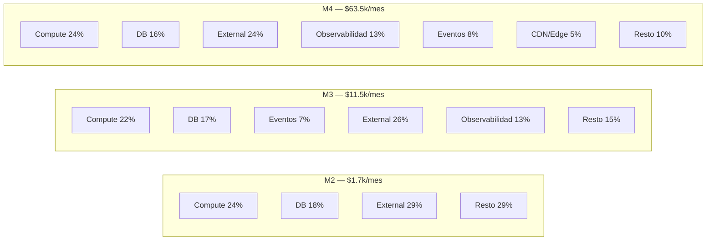

### 8.4 Optimización recomendada

| Momento | Foco de optimización |
| --- | --- |
| M1 | Créditos de cloud (AWS Activate, GCP for Startups). PaaS hasta donde aguante |
| M2 | **Reserved Instances / Savings Plans** para baseline (~30% off). Right-sizing de DB |
| M3 | **Spot instances** para workers. **Compaction** de Kafka. **Tier-down** de logs viejos a S3 Glacier |
| M4 | **FinOps integrado**: showback por equipo/servicio, alertas de costo, **commitments** plurianuales |

---

## 9. Diagrama de Secuencia: Checkout Saga (M3)

> [!IMPORTANT]
> Este es el flujo **crítico** de M3: muestra cómo `svc-checkout` orquesta una saga distribuida con **compensaciones** ante fallos en cualquier paso. Es el caso real que justifica casi todos los patrones del momento (Saga, Outbox, Idempotency, DLQ).

### 9.1 Camino feliz

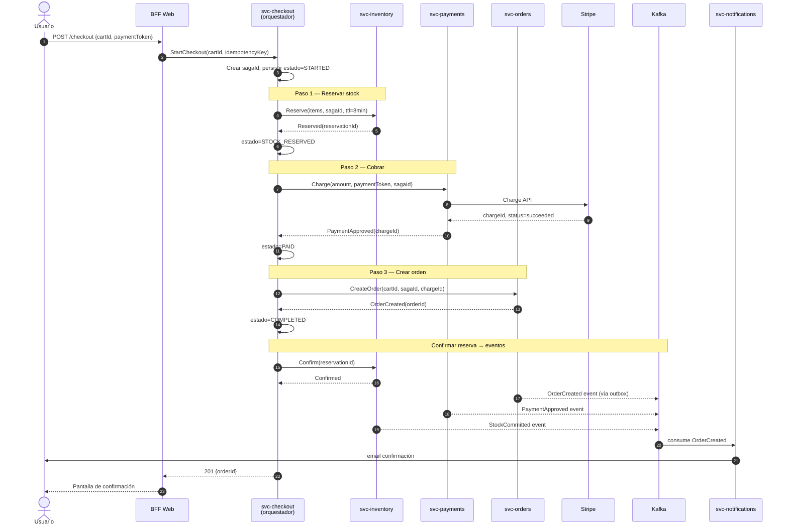

### 9.2 Camino de compensación: pago falla

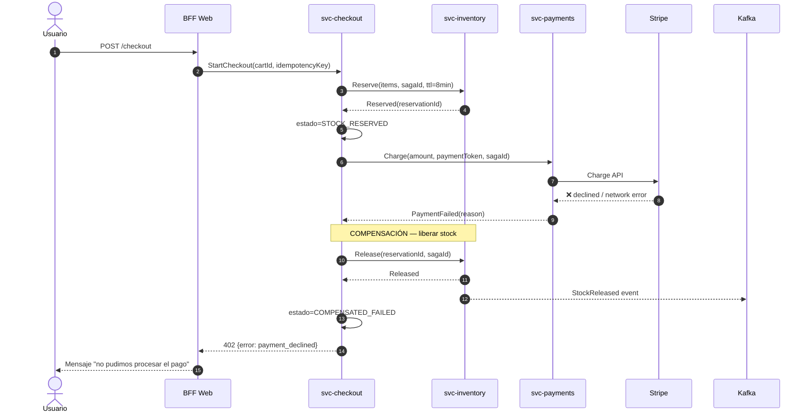

### 9.3 Camino de timeout: usuario no completa, reserva expira

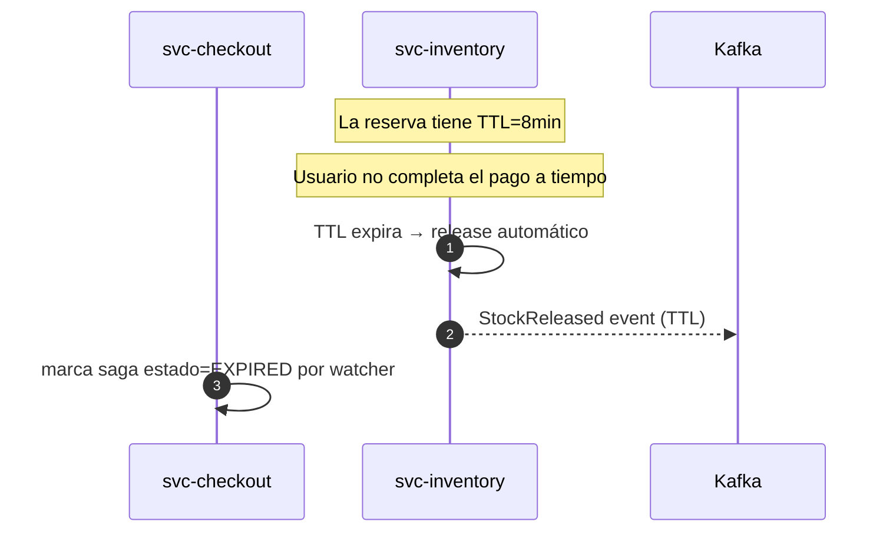

### 9.4 Garantías que aporta la saga

| Garantía | Cómo se obtiene |
| --- | --- |
| **At-least-once** en cada paso | Outbox pattern + retries con backoff |
| **Idempotencia** | `idempotencyKey` del cliente + `sagaId` propagado a cada servicio. `svc-payments` deduplica por `idempotencyKey`; `svc-orders` por `sagaId` |
| **Compensación garantizada** | El orquestador persiste estado tras cada paso. Si muere, al reanudar lee el estado y dispara la compensación pendiente |
| **No double-charge** | Stripe usa el mismo `idempotencyKey`; reintentos del paso 2 no cobran dos veces |
| **No stock fantasma** | Reservas con TTL: si la saga muere antes de confirmar, Redis libera solo |
| **Auditabilidad** | Cada paso emite evento a Kafka → `svc-orders` y Data Warehouse tienen trazabilidad completa |

### 9.5 Estados de la saga

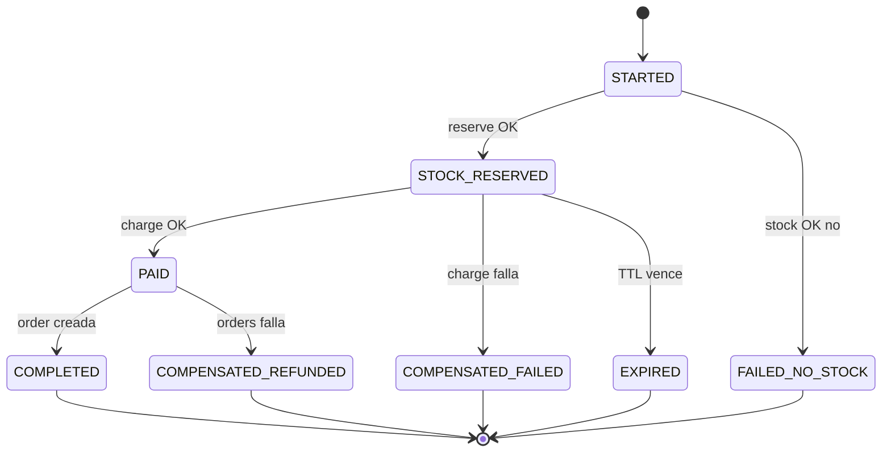

> [!TIP]
> Los estados COMPENSATED se conservan persistidos: son la base de los reportes de pagos rechazados, refunds, y auditoría regulatoria. **Nunca borrar** sagas — son evidencia.

---

## 10. Conclusión

> [!NOTE]
> La arquitectura no es un destino, es **un proceso**. FlashSale en mes 24 no se diseñó en mes 0 — se ganó cada decisión a base de medir, doler, y mover.

Recorrido en una línea:

> **M1** entrega valor rápido aceptando deuda consciente · **M2** paga la deuda mínima para no caer · **M3** rompe el monolito por bounded contexts cuando los equipos lo exigen · **M4** aísla blast radius con celdas y multi-región para SLAs serios.

Y el principio que une los cuatro momentos:

> [!TIP]
> **Mover de momento solo cuando el dolor lo justifique.**
> Métricas concretas (CPU, latencia p95, error budget, equipos pisándose) deben respaldar cada salto.
> Cada salto se hace **incrementalmente, con tráfico real, con feature flags, con la posibilidad de volver atrás en minutos.**
> Eso es lo que separa una arquitectura *que sobrevive* de una que *colapsa* a los 18 meses.

---

## Ver también

- [[reto1-simplificado]]
- [[reto2]]
- [[arquitectura-vs-patrones]]
- [[microservices]]
- [[docker-guia]]
