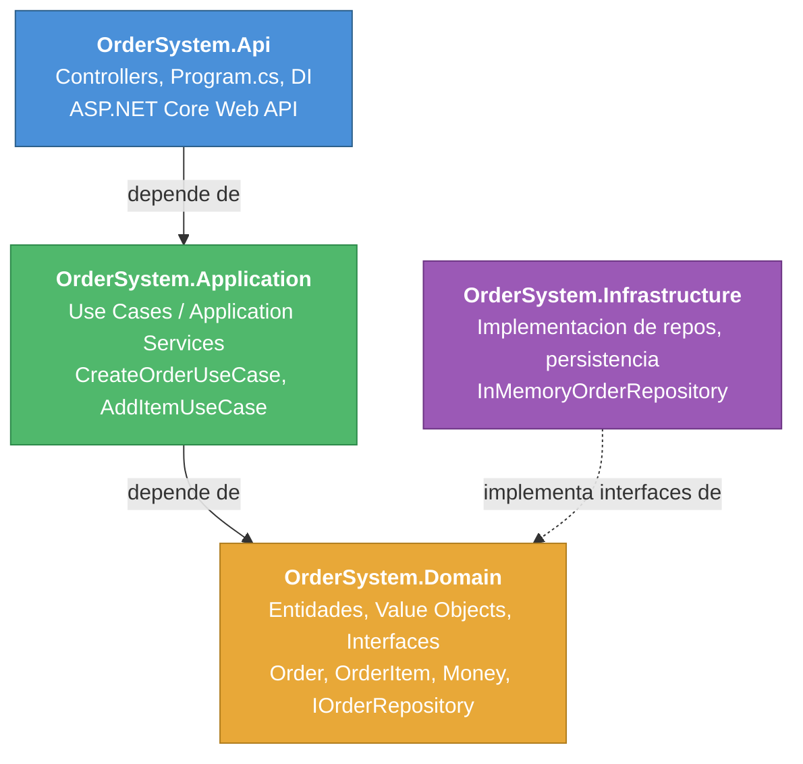
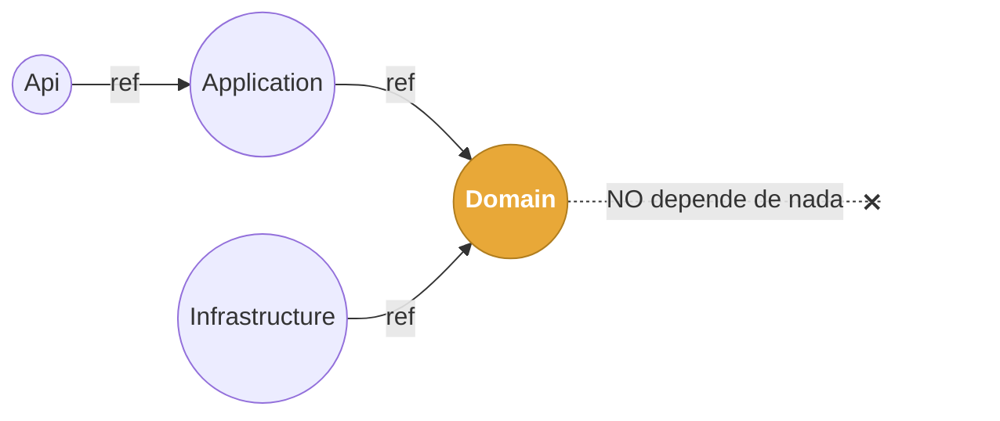
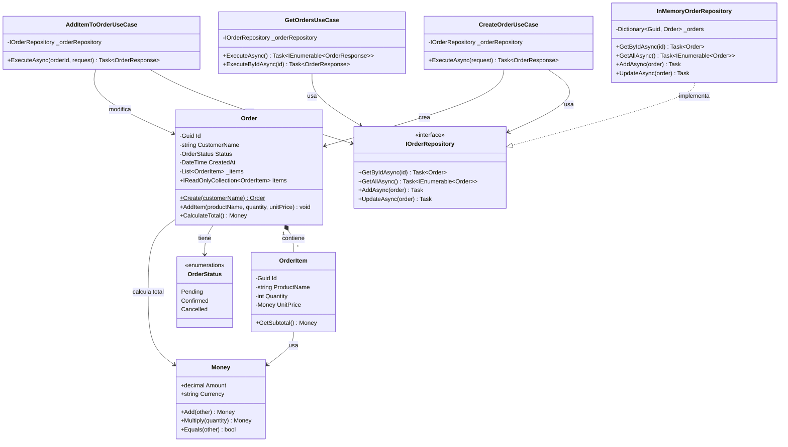
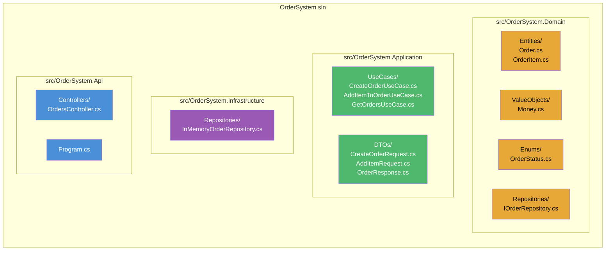
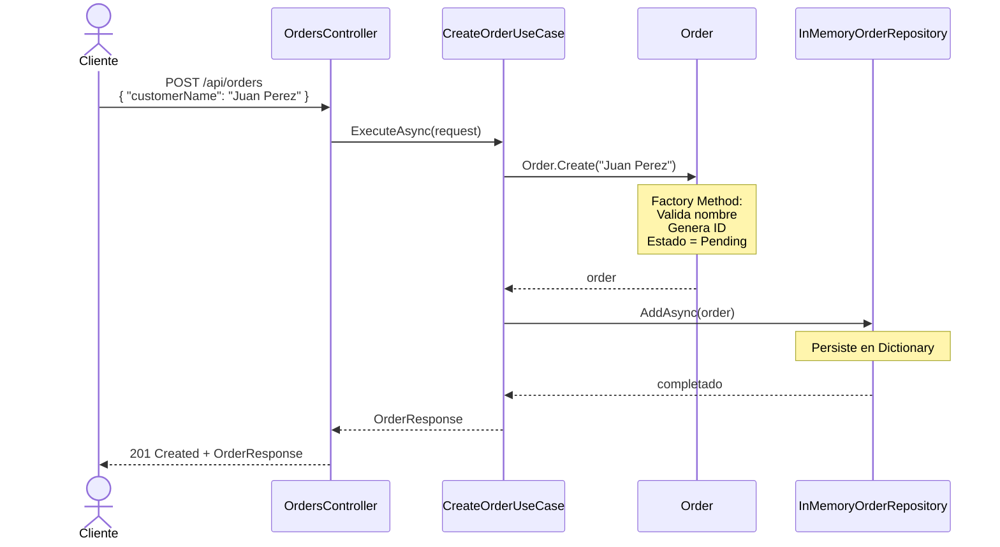
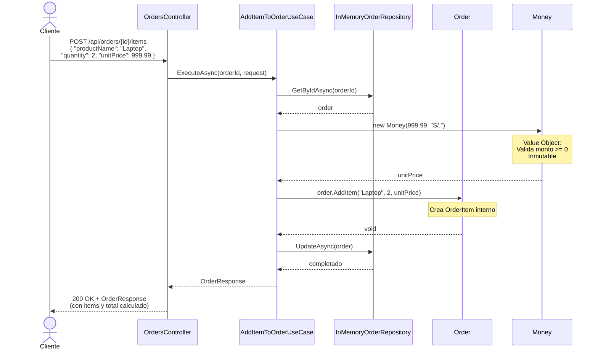
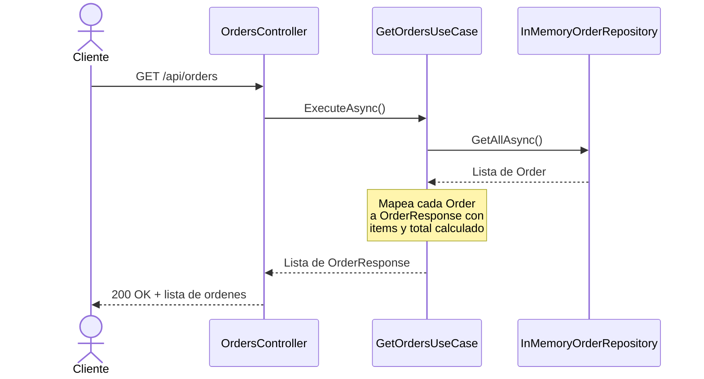
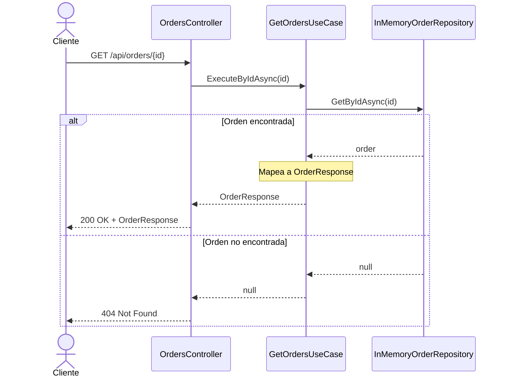

# Reto 2 - Guia de Implementacion

## Dominio Elegido: Sistema de Ordenes de Compra

Se implementa un sistema de ordenes donde un cliente puede **crear una orden**, **agregar items**, **listar todas las ordenes** y **obtener una orden por ID**. Esto cubre el flujo minimo exigido (crear entidad + agregar elemento) y ademas permite consultar la informacion almacenada.

---

## 1. Arquitectura: Clean Architecture / Capas



### Diagrama de dependencias entre proyectos



> El dominio es completamente independiente de frameworks y de infraestructura.

### Diagrama de Clases del Dominio



---

## 2. Patrones de Diseno Utilizados

### 2.1 Repository Pattern

**Donde:** `IOrderRepository` (Domain) + `InMemoryOrderRepository` (Infrastructure)

**Justificacion:** Actua como frontera entre el dominio y la persistencia. El dominio define la interfaz (`IOrderRepository`) y la infraestructura la implementa. Esto permite cambiar la persistencia (de in-memory a SQL, MongoDB, etc.) sin tocar el dominio.

**Trade-off:** Agrega una capa de abstraccion. En un proyecto pequeno podria verse como over-engineering, pero aqui se justifica porque es requisito del reto y permite testear el dominio sin base de datos real.

### 2.2 Dependency Injection (DI)

**Donde:** `Program.cs` en la capa Api registra las dependencias.

**Justificacion:** Desacopla las capas. El controlador no sabe que repositorio concreto se usa; solo conoce la abstraccion. Esto facilita el testing y el intercambio de implementaciones.

### 2.3 Factory Method (condicional)

**Donde:** Metodo estatico `Order.Create(...)` dentro de la entidad `Order`.

**Justificacion:** La creacion de una Order tiene reglas de negocio (validar que el cliente no sea vacio, generar ID, establecer estado inicial). Encapsular esto en un factory method dentro de la propia entidad evita que la logica de creacion quede dispersa. Se usa **solo porque hay reglas**, no por obligacion.

**Trade-off:** Una clase Factory separada (`OrderFactory`) seria excesiva aqui porque no hay multiples variantes de Order. El factory method en la entidad es suficiente.

### 2.4 Value Object

**Donde:** `Money` (valor monetario con moneda).

**Justificacion:** Evita usar `decimal` suelto para representar precios. `Money` garantiza inmutabilidad, validacion (no negativo) y igualdad por valor. Esto es un concepto central de DDD.

### 2.5 Rich Domain Model (anti-modelo anemico)

**Donde:** La entidad `Order` contiene comportamiento (`AddItem`, `CalculateTotal`), no solo propiedades.

**Justificacion:** Es requisito del reto. Las reglas de negocio viven en el dominio, no en los servicios de aplicacion.

---

## 3. Estructura del Proyecto



---

## 4. Codigo de Implementacion

### 4.1 Capa Domain

#### `OrderStatus.cs`
```csharp
namespace OrderSystem.Domain.Enums;

public enum OrderStatus
{
    Pending,
    Confirmed,
    Cancelled
}
```

#### `Money.cs` (Value Object)
```csharp
namespace OrderSystem.Domain.ValueObjects;

public sealed class Money : IEquatable<Money>
{
    public decimal Amount { get; }
    public string Currency { get; }

    public Money(decimal amount, string currency)
    {
        if (amount < 0)
            throw new ArgumentException("El monto no puede ser negativo.", nameof(amount));
        if (string.IsNullOrWhiteSpace(currency))
            throw new ArgumentException("La moneda es requerida.", nameof(currency));

        Amount = amount;
        Currency = currency.ToUpperInvariant();
    }

    public Money Add(Money other)
    {
        if (Currency != other.Currency)
            throw new InvalidOperationException("No se pueden sumar monedas diferentes.");
        return new Money(Amount + other.Amount, Currency);
    }

    public Money Multiply(int quantity)
    {
        return new Money(Amount * quantity, Currency);
    }

    // Igualdad por valor (caracteristica de Value Object)
    public bool Equals(Money? other) =>
        other is not null && Amount == other.Amount && Currency == other.Currency;

    public override bool Equals(object? obj) => Equals(obj as Money);
    public override int GetHashCode() => HashCode.Combine(Amount, Currency);
}
```

#### `OrderItem.cs` (Entidad hija)
```csharp
namespace OrderSystem.Domain.Entities;

using OrderSystem.Domain.ValueObjects;

public class OrderItem
{
    public Guid Id { get; private set; }
    public string ProductName { get; private set; }
    public int Quantity { get; private set; }
    public Money UnitPrice { get; private set; }

    // Constructor privado: se crea via metodo interno
    internal OrderItem(string productName, int quantity, Money unitPrice)
    {
        if (string.IsNullOrWhiteSpace(productName))
            throw new ArgumentException("El nombre del producto es requerido.");
        if (quantity <= 0)
            throw new ArgumentException("La cantidad debe ser mayor a cero.");

        Id = Guid.NewGuid();
        ProductName = productName;
        Quantity = quantity;
        UnitPrice = unitPrice;
    }

    public Money GetSubtotal() => UnitPrice.Multiply(Quantity);
}
```

#### `Order.cs` (Entidad principal con comportamiento)
```csharp
namespace OrderSystem.Domain.Entities;

using OrderSystem.Domain.Enums;
using OrderSystem.Domain.ValueObjects;

public class Order
{
    public Guid Id { get; private set; }
    public string CustomerName { get; private set; } = string.Empty;
    public OrderStatus Status { get; private set; }
    public DateTime CreatedAt { get; private set; }

    private readonly List<OrderItem> _items = new();
    public IReadOnlyCollection<OrderItem> Items => _items.AsReadOnly();

    private Order() { }

    // Factory Method: encapsula las reglas de creacion
    public static Order Create(string customerName)
    {
        if (string.IsNullOrWhiteSpace(customerName))
            throw new ArgumentException("El nombre del cliente es requerido.");

        return new Order
        {
            Id = Guid.NewGuid(),
            CustomerName = customerName,
            Status = OrderStatus.Pending,
            CreatedAt = DateTime.UtcNow
        };
    }

    public void AddItem(string productName, int quantity, Money unitPrice)
    {
        var item = new OrderItem(productName, quantity, unitPrice);
        _items.Add(item);
    }

    public Money CalculateTotal()
    {
        if (!_items.Any())
            return new Money(0, "S/.");

        return _items
            .Select(i => i.GetSubtotal())
            .Aggregate((a, b) => a.Add(b));
    }
}
```

#### `IOrderRepository.cs`
```csharp
namespace OrderSystem.Domain.Repositories;

using OrderSystem.Domain.Entities;

public interface IOrderRepository
{
    Task<Order?> GetByIdAsync(Guid id);
    Task<IEnumerable<Order>> GetAllAsync();
    Task AddAsync(Order order);
    Task UpdateAsync(Order order);
}
```

---

### 4.2 Capa Application

#### `CreateOrderRequest.cs`
```csharp
namespace OrderSystem.Application.DTOs;

public record CreateOrderRequest(string CustomerName);
```

#### `AddItemRequest.cs`
```csharp
namespace OrderSystem.Application.DTOs;

public record AddItemRequest(string ProductName, int Quantity, decimal UnitPrice, string Currency = "S/.");
```

#### `OrderResponse.cs`
```csharp
namespace OrderSystem.Application.DTOs;

public record OrderItemResponse(Guid Id, string ProductName, int Quantity, decimal UnitPrice, decimal Subtotal);

public record OrderResponse(
    Guid Id,
    string CustomerName,
    string Status,
    DateTime CreatedAt,
    List<OrderItemResponse> Items,
    decimal Total
);
```

#### `CreateOrderUseCase.cs`
```csharp
namespace OrderSystem.Application.UseCases;

using OrderSystem.Application.DTOs;
using OrderSystem.Domain.Entities;
using OrderSystem.Domain.Repositories;

public class CreateOrderUseCase
{
    private readonly IOrderRepository _orderRepository;

    public CreateOrderUseCase(IOrderRepository orderRepository)
    {
        _orderRepository = orderRepository;
    }

    public async Task<OrderResponse> ExecuteAsync(CreateOrderRequest request)
    {
        var order = Order.Create(request.CustomerName);
        await _orderRepository.AddAsync(order);

        return MapToResponse(order);
    }

    private static OrderResponse MapToResponse(Order order)
    {
        var items = order.Items.Select(i => new OrderItemResponse(
            i.Id, i.ProductName, i.Quantity, i.UnitPrice.Amount, i.GetSubtotal().Amount
        )).ToList();

        return new OrderResponse(
            order.Id,
            order.CustomerName,
            order.Status.ToString(),
            order.CreatedAt,
            items,
            order.CalculateTotal().Amount
        );
    }
}
```

#### `AddItemToOrderUseCase.cs`
```csharp
namespace OrderSystem.Application.UseCases;

using OrderSystem.Application.DTOs;
using OrderSystem.Domain.Repositories;
using OrderSystem.Domain.ValueObjects;

public class AddItemToOrderUseCase
{
    private readonly IOrderRepository _orderRepository;

    public AddItemToOrderUseCase(IOrderRepository orderRepository)
    {
        _orderRepository = orderRepository;
    }

    public async Task<OrderResponse> ExecuteAsync(Guid orderId, AddItemRequest request)
    {
        var order = await _orderRepository.GetByIdAsync(orderId)
            ?? throw new KeyNotFoundException($"Orden con ID {orderId} no encontrado.");

        var unitPrice = new Money(request.UnitPrice, request.Currency);
        order.AddItem(request.ProductName, request.Quantity, unitPrice);

        await _orderRepository.UpdateAsync(order);

        var items = order.Items.Select(i => new OrderItemResponse(
            i.Id, i.ProductName, i.Quantity, i.UnitPrice.Amount, i.GetSubtotal().Amount
        )).ToList();

        return new OrderResponse(
            order.Id,
            order.CustomerName,
            order.Status.ToString(),
            order.CreatedAt,
            items,
            order.CalculateTotal().Amount
        );
    }
}
```

#### `GetOrdersUseCase.cs`
```csharp
namespace OrderSystem.Application.UseCases;

using OrderSystem.Application.DTOs;
using OrderSystem.Domain.Repositories;

public class GetOrdersUseCase
{
    private readonly IOrderRepository _orderRepository;

    public GetOrdersUseCase(IOrderRepository orderRepository)
    {
        _orderRepository = orderRepository;
    }

    public async Task<IEnumerable<OrderResponse>> ExecuteAsync()
    {
        var orders = await _orderRepository.GetAllAsync();

        return orders.Select(order =>
        {
            var items = order.Items.Select(i => new OrderItemResponse(
                i.Id, i.ProductName, i.Quantity, i.UnitPrice.Amount, i.GetSubtotal().Amount
            )).ToList();

            return new OrderResponse(
                order.Id,
                order.CustomerName,
                order.Status.ToString(),
                order.CreatedAt,
                items,
                order.CalculateTotal().Amount
            );
        });
    }

    public async Task<OrderResponse?> ExecuteByIdAsync(Guid id)
    {
        var order = await _orderRepository.GetByIdAsync(id);
        if (order is null) return null;

        var items = order.Items.Select(i => new OrderItemResponse(
            i.Id, i.ProductName, i.Quantity, i.UnitPrice.Amount, i.GetSubtotal().Amount
        )).ToList();

        return new OrderResponse(
            order.Id,
            order.CustomerName,
            order.Status.ToString(),
            order.CreatedAt,
            items,
            order.CalculateTotal().Amount
        );
    }
}
```

---

### 4.3 Capa Infrastructure

#### `InMemoryOrderRepository.cs`
```csharp
namespace OrderSystem.Infrastructure.Repositories;

using OrderSystem.Domain.Entities;
using OrderSystem.Domain.Repositories;

public class InMemoryOrderRepository : IOrderRepository
{
    private readonly Dictionary<Guid, Order> _orders = new();

    public Task<Order?> GetByIdAsync(Guid id)
    {
        _orders.TryGetValue(id, out var order);
        return Task.FromResult(order);
    }

    public Task<IEnumerable<Order>> GetAllAsync()
    {
        return Task.FromResult<IEnumerable<Order>>(_orders.Values.ToList());
    }

    public Task AddAsync(Order order)
    {
        _orders[order.Id] = order;
        return Task.CompletedTask;
    }

    public Task UpdateAsync(Order order)
    {
        _orders[order.Id] = order;
        return Task.CompletedTask;
    }
}
```

---

### 4.4 Capa Api

#### `OrdersController.cs`
```csharp
namespace OrderSystem.Api.Controllers;

using Microsoft.AspNetCore.Mvc;
using OrderSystem.Application.DTOs;
using OrderSystem.Application.UseCases;

[ApiController]
[Route("api/[controller]")]
public class OrdersController : ControllerBase
{
    private readonly CreateOrderUseCase _createOrder;
    private readonly AddItemToOrderUseCase _addItem;
    private readonly GetOrdersUseCase _getOrders;

    public OrdersController(
        CreateOrderUseCase createOrder,
        AddItemToOrderUseCase addItem,
        GetOrdersUseCase getOrders)
    {
        _createOrder = createOrder;
        _addItem = addItem;
        _getOrders = getOrders;
    }

    [HttpGet]
    public async Task<IActionResult> GetAll()
    {
        var result = await _getOrders.ExecuteAsync();
        return Ok(result);
    }

    [HttpGet("{orderId:guid}")]
    public async Task<IActionResult> GetById(Guid orderId)
    {
        var result = await _getOrders.ExecuteByIdAsync(orderId);
        if (result is null) return NotFound();
        return Ok(result);
    }

    [HttpPost]
    public async Task<IActionResult> Create([FromBody] CreateOrderRequest request)
    {
        var result = await _createOrder.ExecuteAsync(request);
        return CreatedAtAction(nameof(Create), new { id = result.Id }, result);
    }

    [HttpPost("{orderId:guid}/items")]
    public async Task<IActionResult> AddItem(Guid orderId, [FromBody] AddItemRequest request)
    {
        var result = await _addItem.ExecuteAsync(orderId, request);
        return Ok(result);
    }
}
```

#### `Program.cs`
```csharp
using OrderSystem.Application.UseCases;
using OrderSystem.Domain.Repositories;
using OrderSystem.Infrastructure.Repositories;

var builder = WebApplication.CreateBuilder(args);

// --- DEPENDENCY INJECTION ---
// Singleton porque InMemory necesita compartir estado entre requests
builder.Services.AddSingleton<IOrderRepository, InMemoryOrderRepository>();
builder.Services.AddScoped<CreateOrderUseCase>();
builder.Services.AddScoped<AddItemToOrderUseCase>();
builder.Services.AddScoped<GetOrdersUseCase>();

builder.Services.AddControllers();
builder.Services.AddEndpointsApiExplorer();
builder.Services.AddSwaggerGen();

var app = builder.Build();

app.UseSwagger();
app.UseSwaggerUI();
app.MapControllers();
app.Run();
```

---

## 5. Comandos para Crear el Proyecto

```bash
# Crear solucion
dotnet new sln -n OrderSystem

# Crear proyectos
dotnet new classlib -n OrderSystem.Domain -o src/OrderSystem.Domain
dotnet new classlib -n OrderSystem.Application -o src/OrderSystem.Application
dotnet new classlib -n OrderSystem.Infrastructure -o src/OrderSystem.Infrastructure
dotnet new webapi -n OrderSystem.Api -o src/OrderSystem.Api --no-https

# Agregar proyectos a la solucion
dotnet sln add src/OrderSystem.Domain
dotnet sln add src/OrderSystem.Application
dotnet sln add src/OrderSystem.Infrastructure
dotnet sln add src/OrderSystem.Api

# Configurar dependencias (solo las permitidas)
dotnet add src/OrderSystem.Api reference src/OrderSystem.Application
dotnet add src/OrderSystem.Api reference src/OrderSystem.Infrastructure
dotnet add src/OrderSystem.Application reference src/OrderSystem.Domain
dotnet add src/OrderSystem.Infrastructure reference src/OrderSystem.Domain
```

---

## 6. Flujo End-to-End del Caso de Uso

### Caso de Uso 1: Crear Orden



### Caso de Uso 2: Agregar Item a Orden



### Caso de Uso 3: Listar Todas las Ordenes



### Caso de Uso 4: Obtener Orden por ID



---

## 7. Decisiones Arquitectonicas y Trade-offs

| Decision | Justificacion | Trade-off |
|----------|---------------|-----------|
| **In-Memory Repository** | Simplicidad. No se requiere persistencia real. | Los datos se pierden al reiniciar la app. Suficiente para el alcance. |
| **Factory Method en la entidad** (no clase separada) | Solo hay un tipo de Order. Una clase `OrderFactory` separada seria over-engineering. | Si en el futuro hay multiples tipos de ordenes, habria que refactorizar. |
| **Value Object `Money`** | Evita primitive obsession. Garantiza validacion e inmutabilidad. | Agrega una clase extra, pero el beneficio en claridad y seguridad lo justifica. |
| **Use Cases como clases separadas** (no un unico servicio) | Cada caso de uso tiene una responsabilidad unica (SRP). Facilita testing. | Mas archivos que un solo `OrderService`, pero mejor cohesion. |
| **DTOs en Application** | Evita exponer entidades del dominio a la capa de presentacion. | Requiere mapeo manual (sin AutoMapper para mantener simplicidad). |
| **No se usa CQRS** | El reto dice explicitamente que no se esperan patrones avanzados. | Para un sistema grande seria beneficioso separar lecturas de escrituras. |
| **Singleton para InMemoryRepository** | Necesario para que los datos persistan entre requests HTTP. | Con una DB real seria `Scoped`. |
| **Constructor `internal` en OrderItem** | Solo `Order` puede crear items, protegiendo la invariante del agregado. | Requiere que `Order` y `OrderItem` esten en el mismo proyecto/assembly. |

---

## 8. Principios SOLID Aplicados

| Principio | Como se aplica |
|-----------|----------------|
| **S** - Single Responsibility | Cada Use Case hace una sola cosa. La entidad gestiona sus propias reglas. |
| **O** - Open/Closed | Se pueden agregar nuevos Use Cases sin modificar los existentes. |
| **L** - Liskov Substitution | `InMemoryOrderRepository` es sustituible por cualquier `IOrderRepository`. |
| **I** - Interface Segregation | `IOrderRepository` solo tiene los metodos necesarios. |
| **D** - Dependency Inversion | Application depende de abstracciones (interfaces en Domain), no de implementaciones concretas. |

---

## 9. Conceptos DDD Aplicados

| Concepto | Implementacion |
|----------|----------------|
| **Entidad** | `Order` (tiene identidad unica por `Id` y ciclo de vida) |
| **Value Object** | `Money` (inmutable, igualdad por valor) |
| **Aggregate Root** | `Order` controla el acceso a sus `OrderItems` |
| **Repository** | `IOrderRepository` define el contrato en el dominio |
| **Ubiquitous Language** | Nombres como `Order`, `OrderItem`, `AddItem`, `CalculateTotal` reflejan el lenguaje del negocio |
| **Rich Model** | Los metodos `AddItem()`, `CalculateTotal()` contienen reglas de negocio |

---

## 10. ADR - Registro de Decisiones Arquitectonicas

### ADR-001: Arquitectura en capas con proyectos separados

- **Estado:** Aceptada
- **Contexto:** Se necesita una estructura que separe responsabilidades y permita que el dominio sea independiente de frameworks.
- **Decision:** Separar la solucion en 4 proyectos: `Domain`, `Application`, `Infrastructure` y `Api`, cada uno como un assembly independiente.
- **Consecuencias:**
  - El dominio no tiene dependencias externas, lo que facilita el testing y la portabilidad.
  - La direccion de dependencias es clara: Api → Application → Domain ← Infrastructure.
  - Mayor cantidad de proyectos en la solucion, pero cada uno con responsabilidad bien definida.

---

### ADR-002: Persistencia en memoria (InMemoryRepository)

- **Estado:** Aceptada
- **Contexto:** El reto no requiere persistencia real compleja. Implementar una base de datos agregaria complejidad sin aportar valor al objetivo del ejercicio.
- **Decision:** Usar un `Dictionary<Guid, Order>` dentro de `InMemoryOrderRepository` como mecanismo de almacenamiento.
- **Consecuencias:**
  - Los datos se pierden al reiniciar la aplicacion.
  - No se necesitan paquetes externos (EF Core, Dapper, etc.).
  - El repositorio se registra como `Singleton` para mantener estado entre requests HTTP.
  - Migrar a una base de datos real solo requiere crear una nueva implementacion de `IOrderRepository` y cambiar el registro en DI.

---

### ADR-003: Factory Method dentro de la entidad (no clase Factory separada)

- **Estado:** Aceptada
- **Contexto:** La creacion de una `Order` requiere validaciones (nombre del cliente no vacio, generar ID, estado inicial). Se necesita encapsular esta logica.
- **Decision:** Usar un metodo estatico `Order.Create(customerName)` en lugar de una clase `OrderFactory` separada.
- **Consecuencias:**
  - La logica de creacion vive junto a la entidad, lo cual es mas cohesivo.
  - El constructor es privado, forzando el uso del factory method.
  - Si en el futuro existieran multiples variantes de `Order`, se deberia evaluar una clase Factory dedicada.

---

### ADR-004: Value Object Money para representar precios

- **Estado:** Aceptada
- **Contexto:** Usar `decimal` directamente para precios genera problemas: no se valida el rango, no se controla la moneda, y se pierde expresividad en el dominio (Primitive Obsession).
- **Decision:** Crear un Value Object `Money` con `Amount` y `Currency`, inmutable y con igualdad por valor.
- **Consecuencias:**
  - Se garantiza que ningun monto sea negativo.
  - Las operaciones (`Add`, `Multiply`) validan compatibilidad de moneda.
  - Se agrega una clase extra al dominio, pero mejora la claridad y seguridad del modelo.

---

### ADR-005: Use Cases como clases individuales

- **Estado:** Aceptada
- **Contexto:** Se puede optar por un unico `OrderService` con multiples metodos, o por clases separadas por caso de uso.
- **Decision:** Cada caso de uso es una clase independiente (`CreateOrderUseCase`, `AddItemToOrderUseCase`).
- **Consecuencias:**
  - Cada clase tiene una unica responsabilidad (SRP).
  - Facilita el testing unitario: se puede testear un caso de uso sin instanciar los demas.
  - Se pueden agregar nuevos casos de uso sin modificar los existentes (OCP).
  - Resulta en mas archivos, pero con mejor cohesion y menor acoplamiento.

---

### ADR-006: DTOs en la capa Application para comunicacion entre capas

- **Estado:** Aceptada
- **Contexto:** Los controllers necesitan recibir datos del cliente y devolver respuestas. Exponer las entidades del dominio directamente romperia el encapsulamiento.
- **Decision:** Definir `records` como DTOs (`CreateOrderRequest`, `AddItemRequest`, `OrderResponse`) en la capa Application.
- **Consecuencias:**
  - Las entidades del dominio no se exponen a la capa de presentacion.
  - Se requiere mapeo manual entre entidades y DTOs (sin AutoMapper para mantener simplicidad).
  - Los DTOs son inmutables (`record`), lo que previene modificaciones accidentales.

---

### ADR-007: Constructor internal en OrderItem para proteger el agregado

- **Estado:** Aceptada
- **Contexto:** `OrderItem` solo debe crearse a traves de `Order.AddItem()`. Permitir su creacion libre romperia las invariantes del agregado.
- **Decision:** Marcar el constructor de `OrderItem` como `internal`, accesible solo dentro del assembly `Domain`.
- **Consecuencias:**
  - Solo `Order` (dentro del mismo assembly) puede instanciar `OrderItem`.
  - Se protege la regla de que no se pueden agregar items a ordenes canceladas.
  - La coleccion de items se expone como `IReadOnlyCollection`, impidiendo modificaciones externas.

---

### ADR-008: No implementar patrones avanzados (CQRS, Event Sourcing, MediatR)

- **Estado:** Aceptada
- **Contexto:** Patrones como CQRS, Event Sourcing o el uso de MediatR son comunes en arquitecturas .NET, pero el reto indica explicitamente que no se esperan.
- **Decision:** Mantener la solucion simple: los Use Cases se inyectan directamente en los controllers sin mediador, y no se separan los modelos de lectura y escritura.
- **Consecuencias:**
  - Menor complejidad y curva de aprendizaje.
  - Menos paquetes externos.
  - Si el proyecto creciera, se podria evaluar su adopcion en el futuro.
