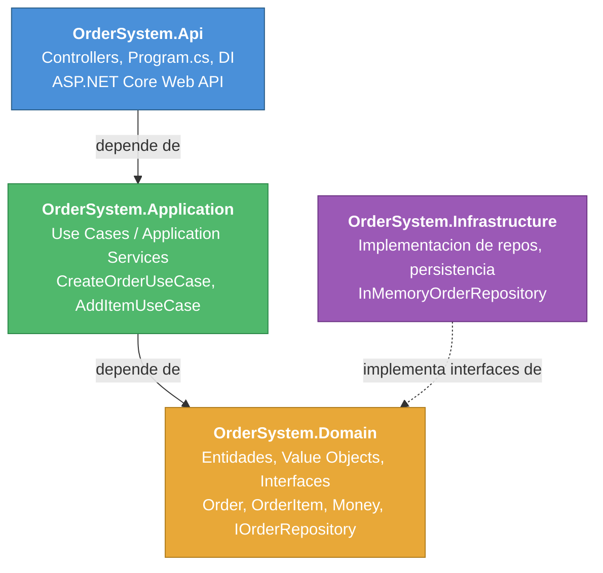
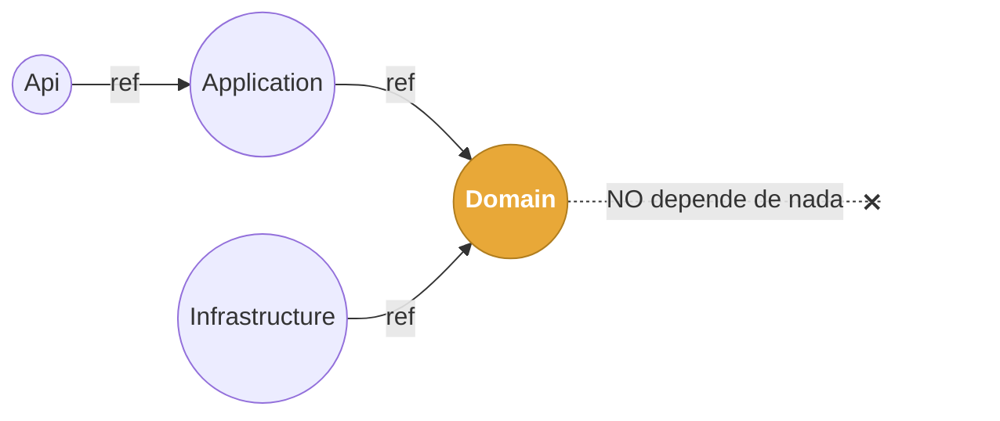
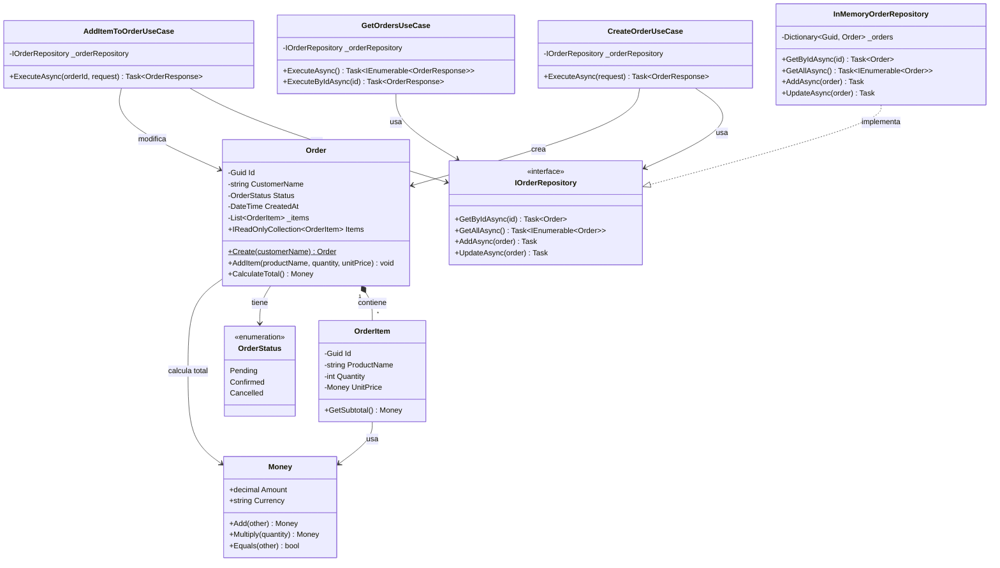
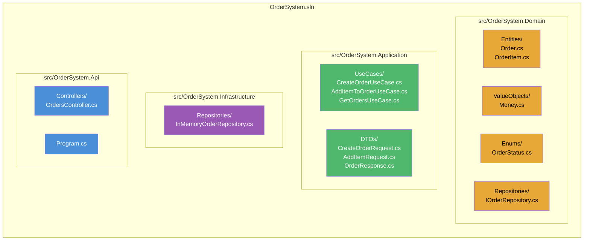
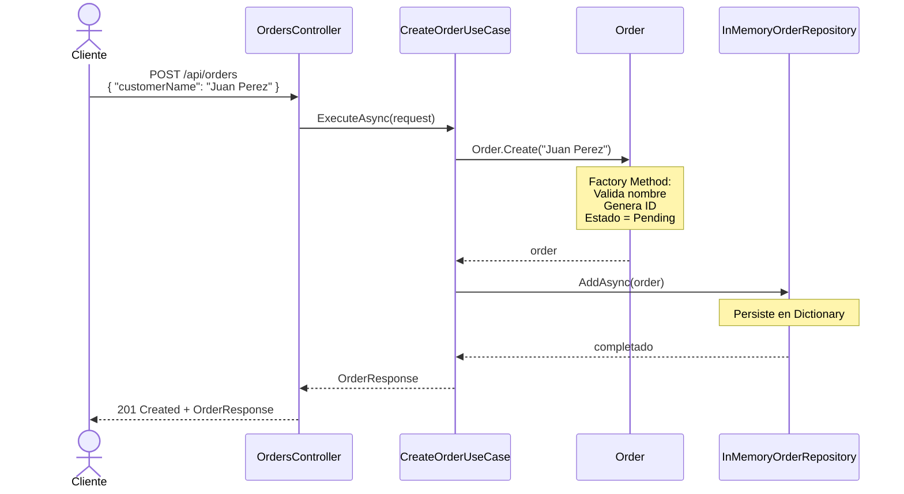
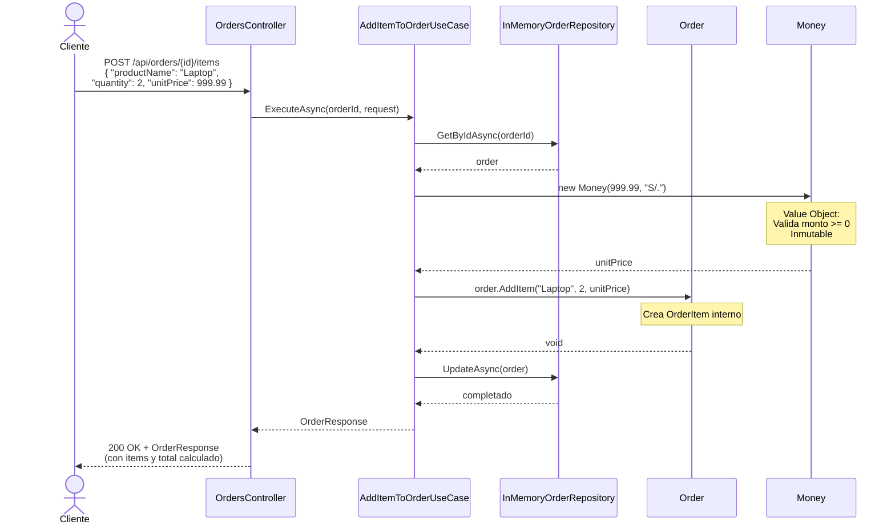
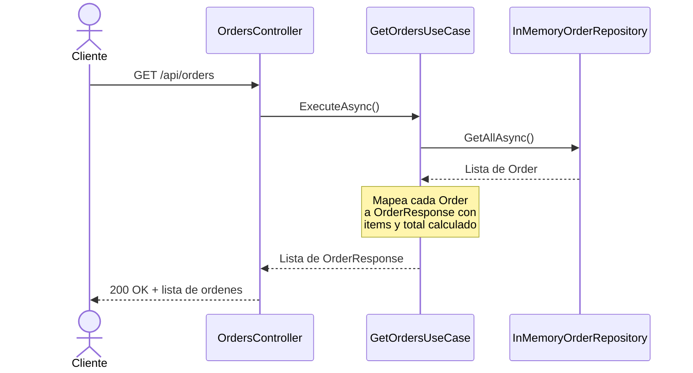
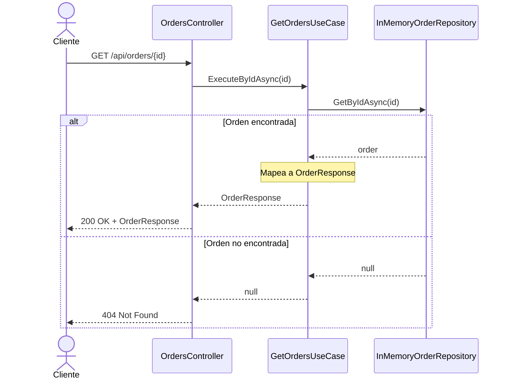

# Reto 2 - Guia de Implementacion

## Dominio Elegido: Sistema de Ordenes de Compra

Se implementa un sistema de ordenes donde un cliente puede **crear una orden**, **agregar items**, **listar todas las ordenes** y **obtener una orden por ID**. Esto cubre el flujo minimo exigido (crear entidad + agregar elemento) y ademas permite consultar la informacion almacenada.

---

## 1. Arquitectura: Clean Architecture / Capas

### Diagrama de dependencias entre proyectos

> El dominio es completamente independiente de frameworks y de infraestructura.

### Diagrama de Clases del Dominio

---

## 2. Patrones de Diseno Utilizados

### 2.1 Repository Pattern

**Donde:** `IOrderRepository` (Domain) + `InMemoryOrderRepository` (Infrastructure)

**Justificacion:** Actua como frontera entre el dominio y la persistencia. El dominio define la interfaz (`IOrderRepository`) y la infraestructura la implementa. Esto permite cambiar la persistencia (de in-memory a SQL, MongoDB, etc.) sin tocar el dominio.

**Trade-off:** Agrega una capa de abstraccion. En un proyecto pequeno podria verse como over-engineering, pero aqui se justifica porque es requisito del reto y permite testear el dominio sin base de datos real.

### 2.2 Dependency Injection (DI)

**Donde:** `Program.cs` en la capa Api registra las dependencias.

**Justificacion:** Desacopla las capas. El controlador no sabe que repositorio concreto se usa; solo conoce la abstraccion. Esto facilita el testing y el intercambio de implementaciones.

### 2.3 Factory Method (condicional)

**Donde:** Metodo estatico `Order.Create(...)` dentro de la entidad `Order`.

**Justificacion:** La creacion de una Order tiene reglas de negocio (validar que el cliente no sea vacio, generar ID, establecer estado inicial). Encapsular esto en un factory method dentro de la propia entidad evita que la logica de creacion quede dispersa. Se usa **solo porque hay reglas**, no por obligacion.

**Trade-off:** Una clase Factory separada (`OrderFactory`) seria excesiva aqui porque no hay multiples variantes de Order. El factory method en la entidad es suficiente.

### 2.4 Value Object

**Donde:** `Money` (valor monetario con moneda).

**Justificacion:** Evita usar `decimal` suelto para representar precios. `Money` garantiza inmutabilidad, validacion (no negativo) y igualdad por valor. Esto es un concepto central de DDD.

### 2.5 Rich Domain Model (anti-modelo anemico)

**Donde:** La entidad `Order` contiene comportamiento (`AddItem`, `CalculateTotal`), no solo propiedades.

**Justificacion:** Es requisito del reto. Las reglas de negocio viven en el dominio, no en los servicios de aplicacion.

---

## 3. Estructura del Proyecto

---

## 4. Flujo End-to-End del Caso de Uso

### Caso de Uso 1: Crear Orden

### Caso de Uso 2: Agregar Item a Orden

### Caso de Uso 3: Listar Todas las Ordenes

### Caso de Uso 4: Obtener Orden por ID

---

## 5. Decisiones Arquitectonicas y Trade-offs

| Decision | Justificacion | Trade-off |
|----------|---------------|-----------|
| **In-Memory Repository** | Simplicidad. No se requiere persistencia real. | Los datos se pierden al reiniciar la app. Suficiente para el alcance. |
| **Factory Method en la entidad** (no clase separada) | Solo hay un tipo de Order. Una clase `OrderFactory` separada seria over-engineering. | Si en el futuro hay multiples tipos de ordenes, habria que refactorizar. |
| **Value Object `Money`** | Evita primitive obsession. Garantiza validacion e inmutabilidad. | Agrega una clase extra, pero el beneficio en claridad y seguridad lo justifica. |
| **Use Cases como clases separadas** (no un unico servicio) | Cada caso de uso tiene una responsabilidad unica (SRP). Facilita testing. | Mas archivos que un solo `OrderService`, pero mejor cohesion. |
| **DTOs en Application** | Evita exponer entidades del dominio a la capa de presentacion. | Requiere mapeo manual (sin AutoMapper para mantener simplicidad). |
| **No se usa CQRS** | El reto dice explicitamente que no se esperan patrones avanzados. | Para un sistema grande seria beneficioso separar lecturas de escrituras. |
| **Singleton para InMemoryRepository** | Necesario para que los datos persistan entre requests HTTP. | Con una DB real seria `Scoped`. |
| **Constructor `internal` en OrderItem** | Solo `Order` puede crear items, protegiendo la invariante del agregado. | Requiere que `Order` y `OrderItem` esten en el mismo proyecto/assembly. |

---

## 6. Principios SOLID Aplicados

| Principio | Como se aplica |
|-----------|----------------|
| **S** - Single Responsibility | Cada Use Case hace una sola cosa. La entidad gestiona sus propias reglas. |
| **O** - Open/Closed | Se pueden agregar nuevos Use Cases sin modificar los existentes. |
| **L** - Liskov Substitution | `InMemoryOrderRepository` es sustituible por cualquier `IOrderRepository`. |
| **I** - Interface Segregation | `IOrderRepository` solo tiene los metodos necesarios. |
| **D** - Dependency Inversion | Application depende de abstracciones (interfaces en Domain), no de implementaciones concretas. |

---

## 7. Conceptos DDD Aplicados

| Concepto | Implementacion |
|----------|----------------|
| **Entidad** | `Order` (tiene identidad unica por `Id` y ciclo de vida) |
| **Value Object** | `Money` (inmutable, igualdad por valor) |
| **Aggregate Root** | `Order` controla el acceso a sus `OrderItems` |
| **Repository** | `IOrderRepository` define el contrato en el dominio |
| **Ubiquitous Language** | Nombres como `Order`, `OrderItem`, `AddItem`, `CalculateTotal` reflejan el lenguaje del negocio |
| **Rich Model** | Los metodos `AddItem()`, `CalculateTotal()` contienen reglas de negocio |
