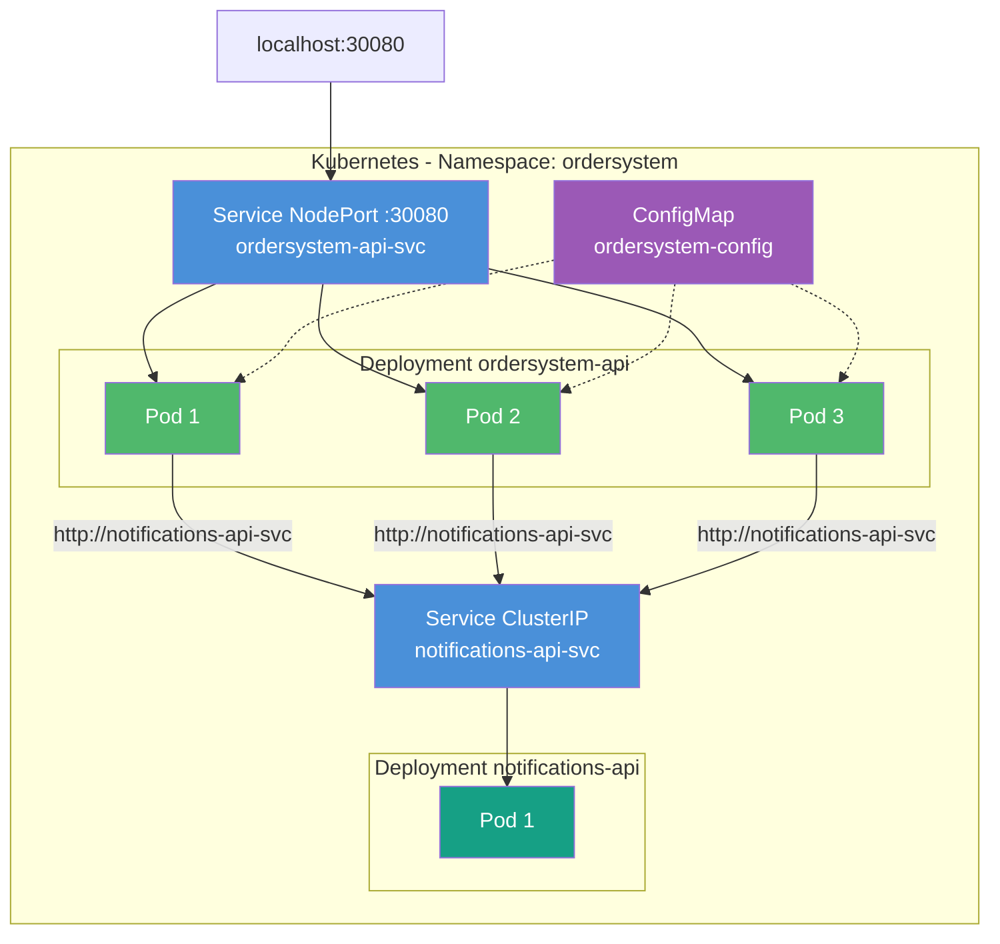
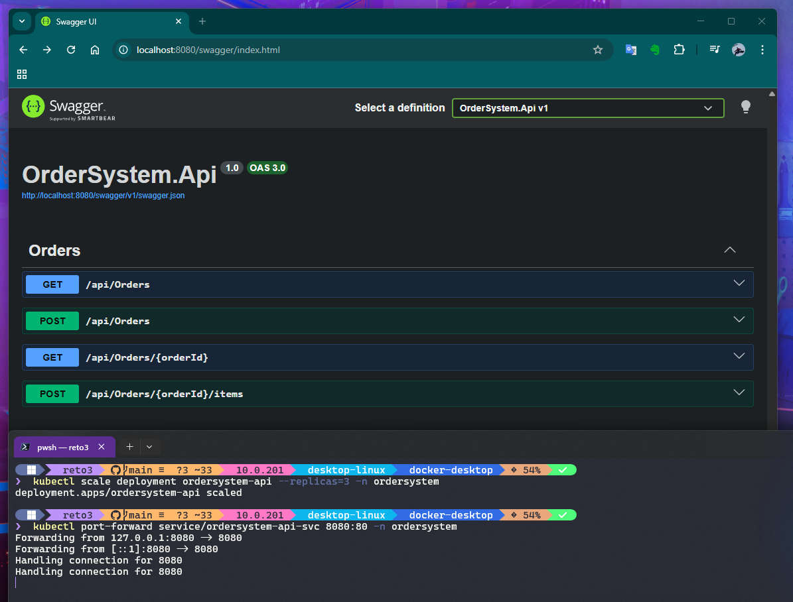
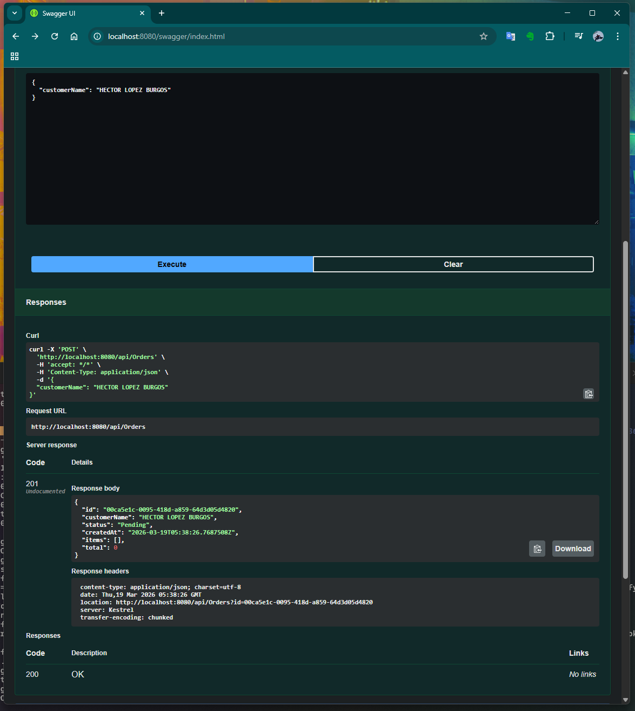
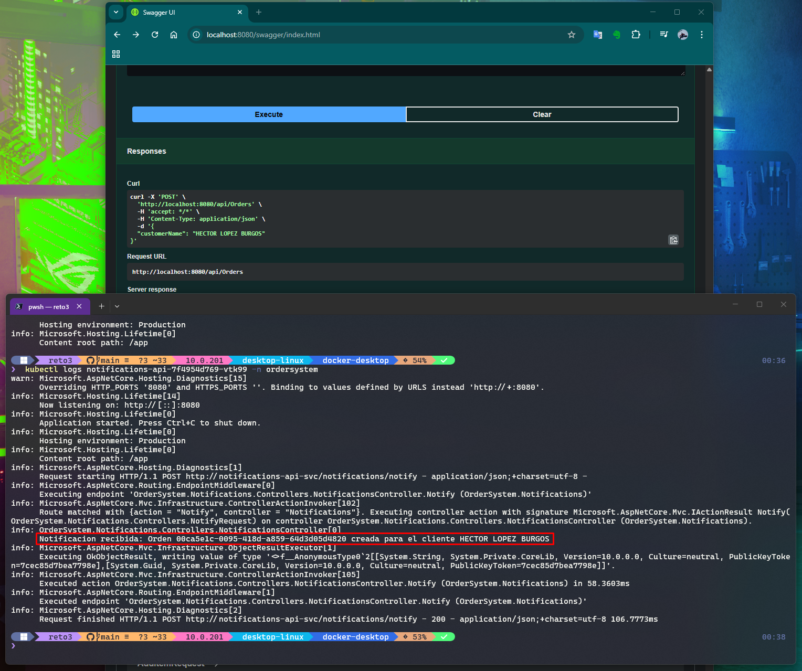
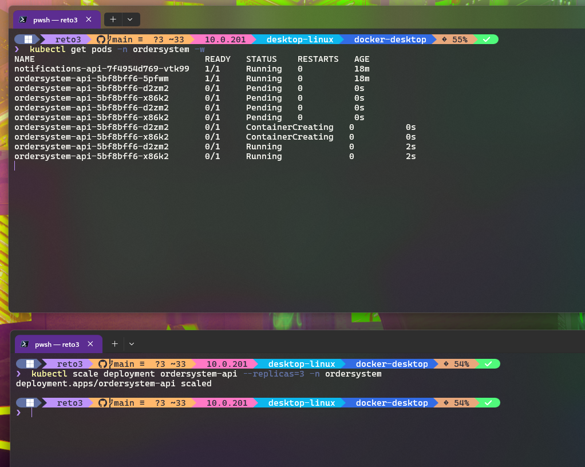
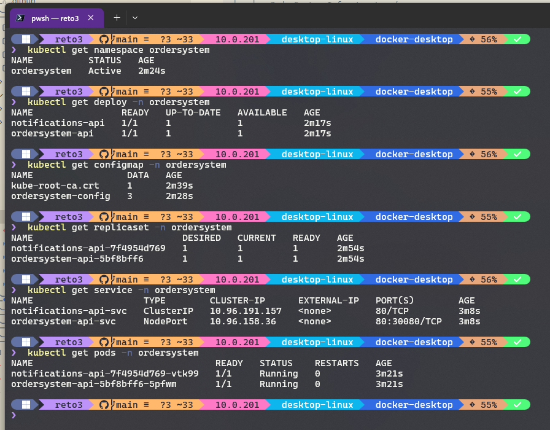

# Reto 3 - Sistema de Ordenes Contenerizado

## Descripcion

Sistema de Ordenes de Compra desplegado en Docker y Kubernetes. Compuesto por dos servicios que se comunican entre si: la API principal de ordenes y un servicio de notificaciones.

---

## 1. Arquitectura de Contenedores



---

## 2. Servicios

### ordersystem-api
API REST para gestion de ordenes de compra. Expone los siguientes endpoints:

| Metodo | Endpoint | Descripcion |
|--------|----------|-------------|
| GET | `/api/orders` | Listar todas las ordenes |
| GET | `/api/orders/{id}` | Obtener orden por ID |
| POST | `/api/orders` | Crear nueva orden |
| POST | `/api/orders/{id}/items` | Agregar item a una orden |
| GET | `/health` | Liveness probe |
| GET | `/health/ready` | Readiness probe |

Al crear una orden notifica al servicio de notificaciones via HTTP.

### notifications-api
Servicio receptor de notificaciones. Expone un unico endpoint:

| Metodo | Endpoint | Descripcion |
|--------|----------|-------------|
| POST | `/notifications/notify` | Recibe y loguea la notificacion |

---

## 3. Estructura del Proyecto

```
reto3/
├── src/
│   ├── OrderSystem.Api/
│   ├── OrderSystem.Application/
│   ├── OrderSystem.Domain/
│   ├── OrderSystem.Infrastructure/
│   └── OrderSystem.Notifications/
├── Dockerfile
├── Dockerfile.notifications
├── docker-compose.yml
└── k8s/
    ├── namespace.yaml
    ├── configmap.yaml
    ├── deployment.yaml
    └── service.yaml
```

---

## 4. Como Ejecutar

### Docker Compose (desarrollo local)

```bash
docker-compose up --build
```

- API disponible en: `http://localhost:8080/swagger`
- Notifications disponible en: `http://localhost:8081/swagger`

### Kubernetes (Docker Desktop)

```bash
# Aplicar manifiestos
kubectl apply -f k8s/namespace.yaml
kubectl apply -f k8s/

# Verificar pods
kubectl get pods -n ordersystem
```

> **Nota:** En Docker Desktop para Windows el NodePort (`localhost:30080`) puede no ser accesible directamente. Usar port-forward como alternativa:
>
> ```bash
> kubectl port-forward service/ordersystem-api-svc 8080:80 -n ordersystem
> ```
>
> API disponible en: `http://localhost:8080/swagger`

### Escalar replicas

```bash
kubectl scale deployment ordersystem-api --replicas=3 -n ordersystem
```

### Verificar self-healing

```bash
# Terminal 1: observar pods
kubectl get pods -n ordersystem -w

# Terminal 2: eliminar un pod
kubectl delete pod <nombre-pod> -n ordersystem
```

---

## 5. Evidencias

### Swagger y creacion de orden



### Comunicacion entre servicios - Notificacion recibida


### Escalado a 3 replicas


### Recursos en Kubernetes


---

## 6. Decisiones Arquitectonicas y Trade-offs

| Decision | Justificacion | Trade-off |
|----------|---------------|-----------|
| **Dockerfile multi-stage** | Imagen final sin SDK (~80 MB vs ~500 MB) | Dockerfile mas complejo |
| **Puerto 8080 en contenedores** | Estandar de contenedores, sin necesidad de root | Requiere NodePort para exponer al exterior |
| **Service ClusterIP para notifications** | Solo debe ser accesible internamente, no desde fuera | No se puede probar notifications directamente desde el host en Kubernetes |
| **NodePort para ordersystem-api** | Acceso externo simple en entorno local | En Docker Desktop para Windows no es accesible via `localhost`, requiere port-forward |
| **ConfigMap para variables de entorno** | Separa configuracion del codigo | Un archivo mas por mantener |
| **try-catch en llamada a notifications** | La creacion de la orden no debe fallar si notifications no esta disponible | El error de notificacion queda silenciado en logs |
| **InMemoryRepository** | El foco del reto es infraestructura, no persistencia | Estado no compartido entre las 3 replicas |
