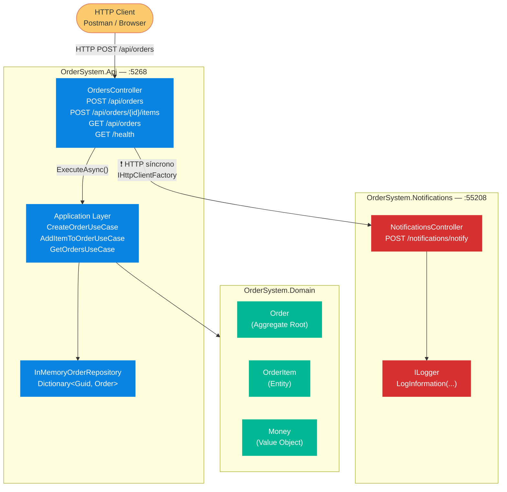
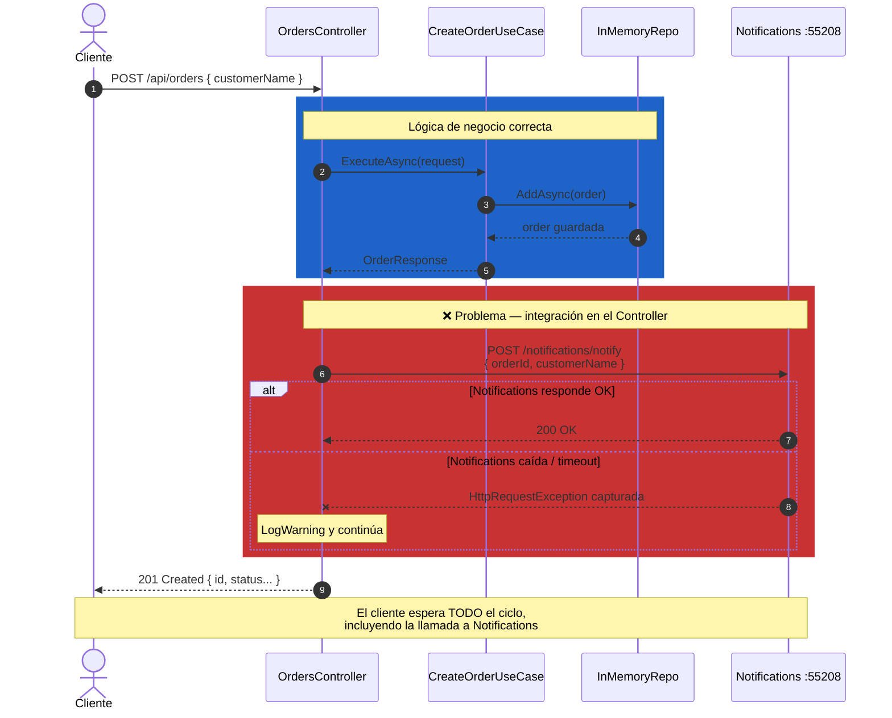
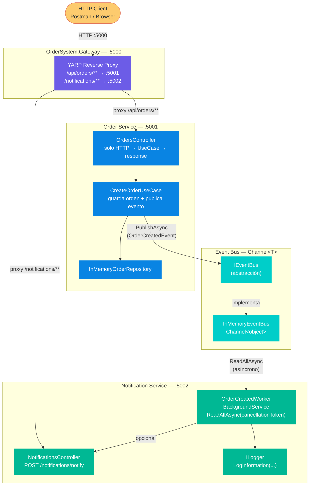
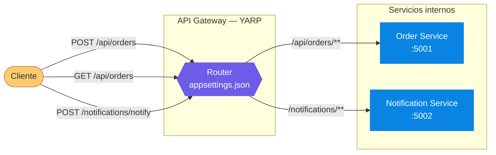
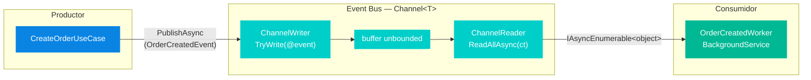
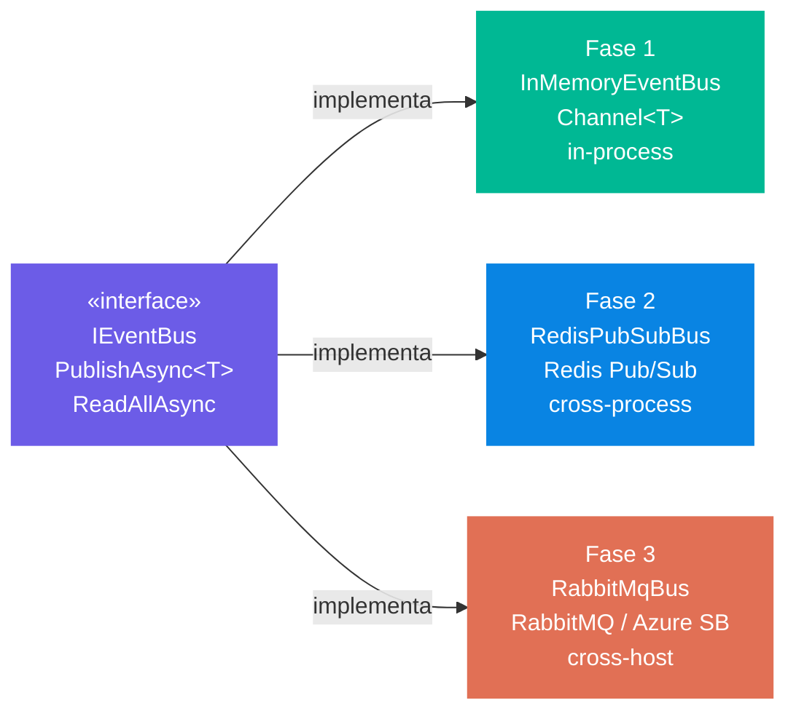
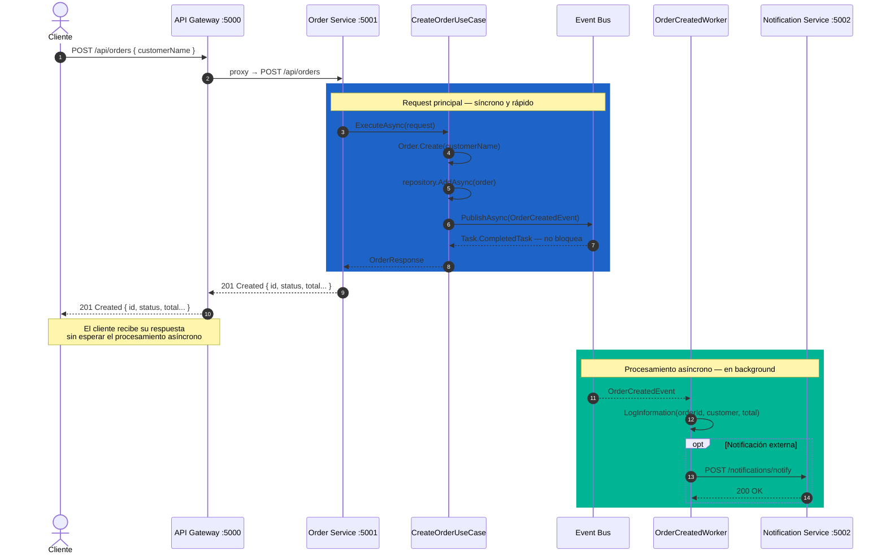
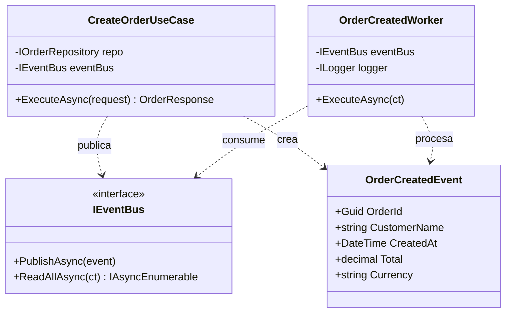
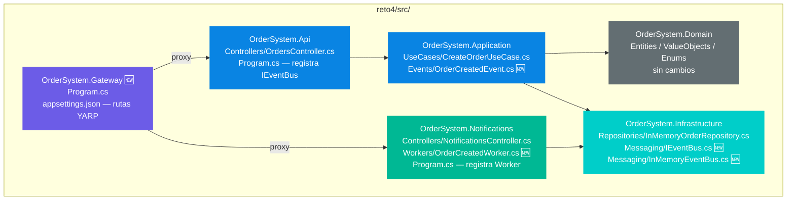
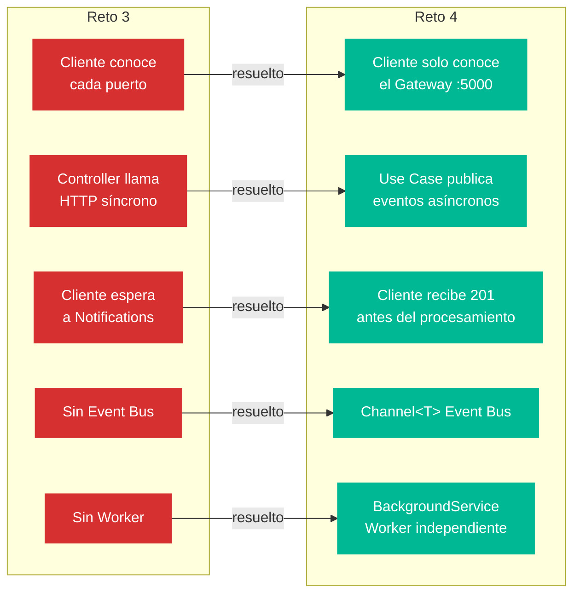

# Reto 4 — Evolución hacia Arquitectura Distribuida

## Índice

1. [Estado actual — Reto 3](#estado-actual--reto-3)
2. [Problemas identificados en Reto 3](#problemas-identificados-en-reto-3)
3. [Evolución — Reto 4](#evolución--reto-4)
4. [Flujo completo de una orden](#flujo-completo-de-una-orden)
5. [Contratos de eventos](#contratos-de-eventos)
6. [Estructura de proyectos](#estructura-de-proyectos)

---

## Estado actual — Reto 3

El reto 3 introduce un segundo servicio (`OrderSystem.Notifications`) y comunicación HTTP directa entre servicios. Es el primer paso hacia la distribución, pero mantiene acoplamiento temporal fuerte.

### Arquitectura de servicios

### Flujo de creación de una orden — Reto 3

---

## Problemas identificados en Reto 3

#### ❌ Problema 1 — Responsabilidad mal ubicada

La llamada al servicio de Notifications está en el `OrdersController` (`OrdersController.cs:52-65`). El Controller tiene una sola responsabilidad: traducir HTTP a Use Cases y devolver una respuesta. La integración con otros servicios no le corresponde — eso es trabajo del Use Case o de la capa de Infrastructure.

#### ❌ Problema 2 — Acoplamiento temporal

La comunicación es HTTP síncrona: el cliente queda bloqueado esperando que Notifications responda antes de recibir su `201 Created`. Si Notifications es lento, el cliente espera más. Si Notifications cae, el error hay que capturarlo en el Controller con un `try/catch`. Dos servicios independientes terminan acoplados en tiempo de respuesta.

#### ❌ Problema 3 — Sin punto de entrada único

El cliente necesita conocer el puerto de cada servicio directamente (`Order API: :5268`, `Notifications: :55208`). Si un servicio cambia de puerto, se escala horizontalmente o se mueve a otro host, el cliente se rompe. No hay ninguna capa que abstraiga esa complejidad.

#### ❌ Problema 4 — Configuración faltante

`NotificationsUrl` no está declarada en `appsettings.json`. El `IHttpClientFactory` intenta leer esa key en runtime y falla silenciosamente o lanza una excepción según el contexto.

---

## Evolución — Reto 4

### Arquitectura objetivo

### Componentes — detalle técnico

#### 1. API Gateway (YARP)

#### 2. Event Bus — flujo de publicación y consumo

#### 3. Evolución posible del Event Bus

---

## Flujo completo de una orden

---

## Contratos de eventos

---

## Estructura de proyectos

### Comparativa reto 3 vs reto 4

---

> **Nota de diseño:** El `InMemoryEventBus` con `Channel<T>` es suficiente para demostrar el patrón en desarrollo local. Pasar a RabbitMQ o Azure Service Bus en producción implica solo una nueva implementación de `IEventBus` y cambiar el registro en DI — los Use Cases y Workers no se tocan.
