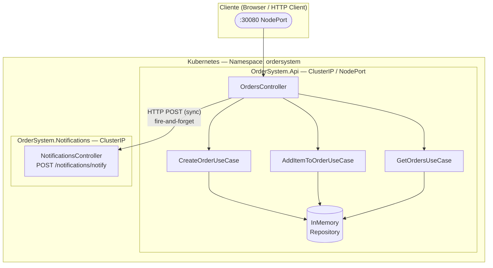
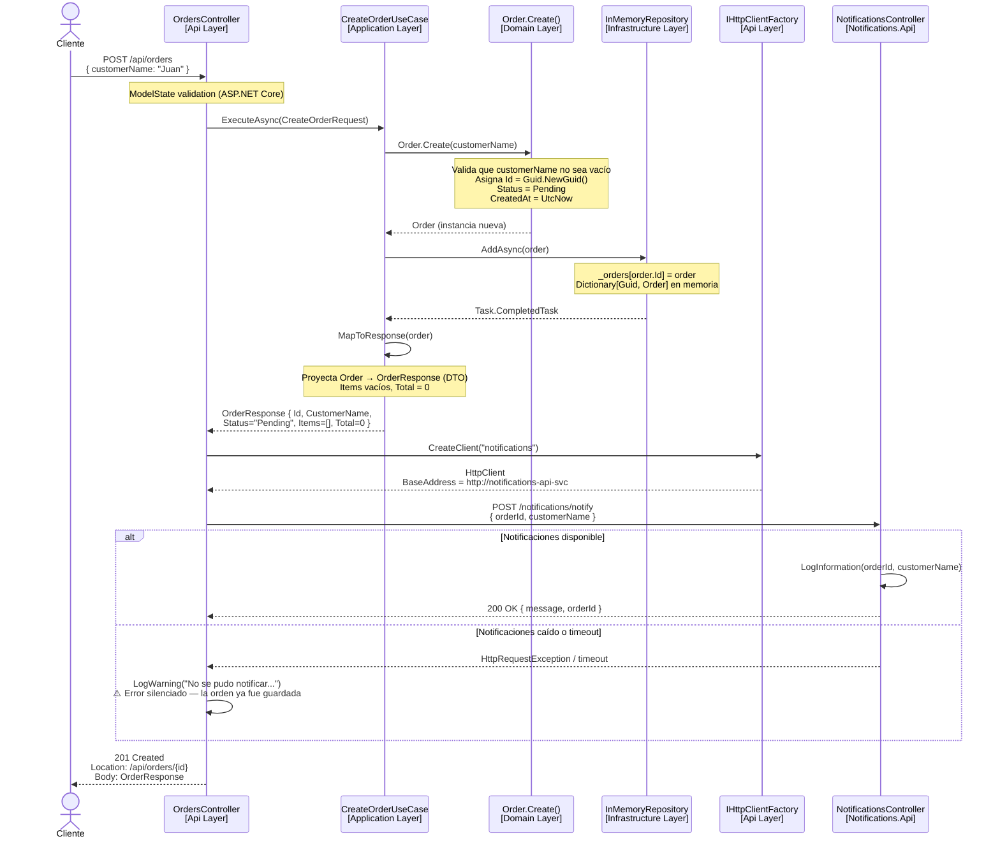
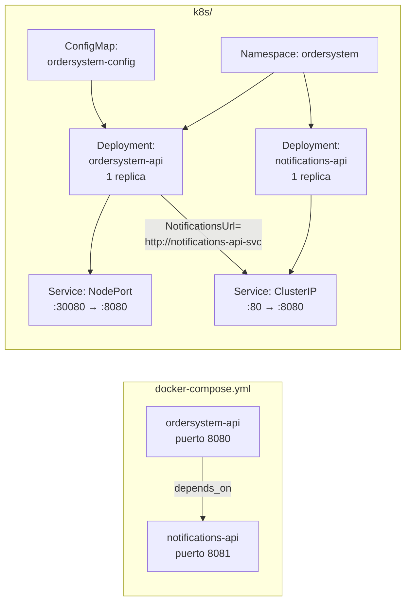
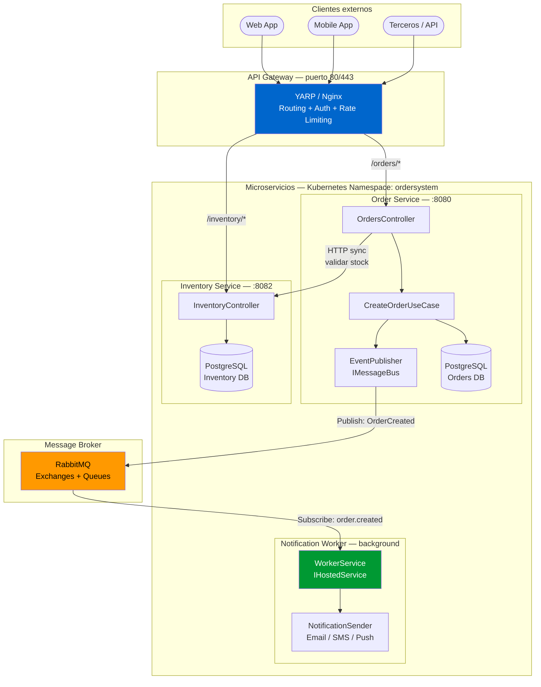
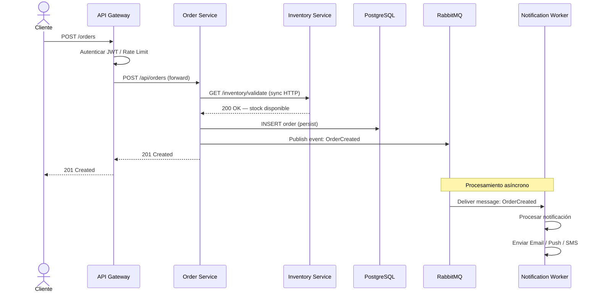
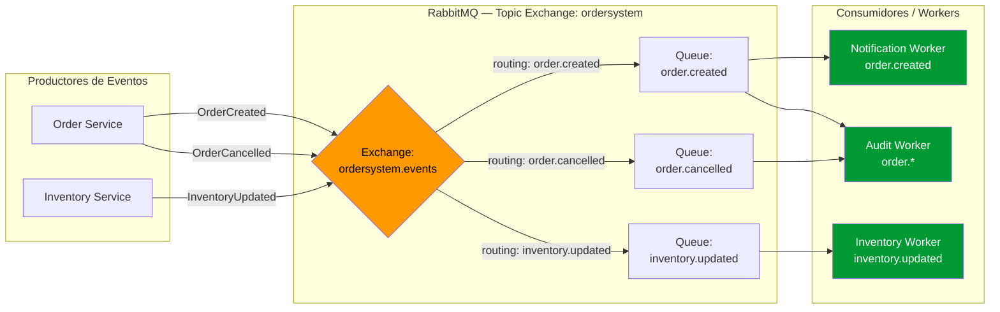
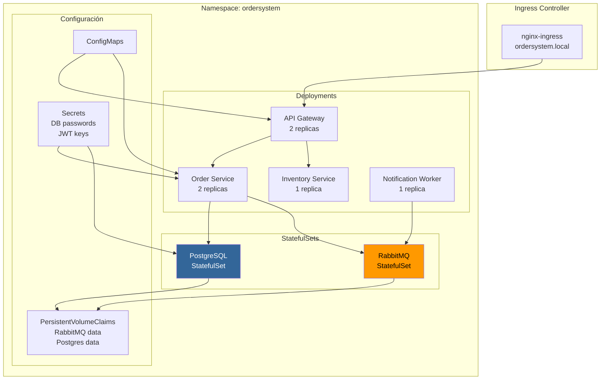
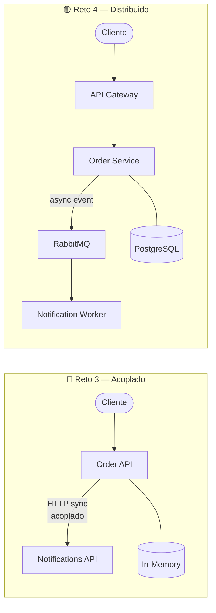

# Reto 4 — Evolución hacia Arquitectura de Microservicios Distribuidos

> [!NOTE]
> Este documento describe el estado actual del sistema (Reto 3) y la evolución propuesta hacia
> una arquitectura distribuida basada en microservicios con API Gateway, comunicación por eventos
> y procesamiento asíncrono con workers.

---

## 1. Estado Actual — Reto 3

### Estructura del Proyecto

El Reto 3 implementa un sistema de órdenes con **dos servicios** desplegados en Kubernetes:

| Servicio | Tecnología | Exposición |
|---|---|---|
| `OrderSystem.Api` | ASP.NET Core (.NET 10) | NodePort 30080 |
| `OrderSystem.Notifications` | ASP.NET Core (.NET 10) | ClusterIP interno |

### Arquitectura Interna del Servicio de Órdenes

El servicio principal sigue una **arquitectura en capas con DDD**:

```
OrderSystem.Api
├── Domain          → Entidades, Value Objects, Interfaces de Repositorio
├── Application     → Use Cases, DTOs
├── Infrastructure  → InMemoryOrderRepository
└── Api             → Controllers, Program.cs
```

### Diagrama de Componentes — Reto 3



> [!WARNING]
> **Comunicación síncrona y acoplada.** El `OrdersController` llama directamente al servicio de
> notificaciones vía `HttpClient`. Si el servicio de notificaciones está caído, el log muestra una
> advertencia pero la orden igual se crea. Esto es un **acoplamiento temporal** disfrazado de
> resiliencia — si en algún momento la notificación fuera crítica, se perdería silenciosamente.

---

### Flujo de Creación de una Orden — Reto 3



> [!WARNING]
> **Punto crítico del flujo:** la orden se persiste en memoria **antes** de llamar a notificaciones.
> Si el proceso se reinicia después de guardar pero antes de notificar, la orden existe pero
> la notificación se perdió para siempre. No hay garantía de entrega — ni reintentos ni DLQ.

---

### Infraestructura — Reto 3



---

### Problemas Identificados en Reto 3

> [!CAUTION]
> Estos son los problemas que motivan la evolución al Reto 4.

| # | Problema | Impacto |
|---|---|---|
| 1 | **Comunicación síncrona entre servicios** | Acoplamiento temporal — si Notifications falla, el evento se pierde |
| 2 | **Storage en memoria** | Sin persistencia — datos se pierden al reiniciar el pod |
| 3 | **Sin API Gateway** | El cliente accede directamente al servicio — sin enrutamiento, auth centralizada ni rate limiting |
| 4 | **Sin mensajería / broker** | No hay cola de eventos — no se puede escalar el procesamiento asíncrono |
| 5 | **Sin workers** | No hay procesamiento en background ni tareas desacopladas |
| 6 | **Single replica sin estado compartido** | No se puede escalar horizontalmente con InMemoryRepository |

---

## 2. Evolución Propuesta — Reto 4

### Objetivo

Transformar el sistema en una **arquitectura distribuida de microservicios** con:

- **API Gateway** como único punto de entrada para los clientes
- **Comunicación por eventos** entre servicios (desacoplamiento asíncrono)
- **Message Broker** (RabbitMQ) como bus de eventos
- **Worker Service** que procesa eventos en background
- **Persistencia real** (reemplaza InMemoryRepository)

---

### Nuevos Componentes

| Componente | Rol | Tecnología |
|---|---|---|
| `ApiGateway` | Enruta, autentica y protege | YARP / Nginx |
| `OrderService` | Dominio de órdenes (evolución del actual) | ASP.NET Core |
| `NotificationWorker` | Procesa eventos `OrderCreated` | .NET Worker Service |
| `InventoryService` | Valida stock antes de confirmar orden | ASP.NET Core |
| `RabbitMQ` | Message broker — bus de eventos | RabbitMQ |
| `PostgreSQL` | Persistencia de órdenes | PostgreSQL |

---

### Diagrama de Arquitectura — Reto 4



---

### Flujo de Creación de Orden — Reto 4



> [!IMPORTANT]
> La diferencia clave con el Reto 3 es que **la notificación ya no bloquea la respuesta al cliente**.
> El Order Service publica el evento en RabbitMQ y responde inmediatamente con `201 Created`.
> El Notification Worker procesa el evento de forma completamente independiente y asíncrona.

---

### Diagrama de Eventos — Bus de Mensajes



---

### Infraestructura Kubernetes — Reto 4



---

### Comparación Reto 3 vs Reto 4



| Aspecto | Reto 3 | Reto 4 |
|---|---|---|
| **Punto de entrada** | Directo al servicio | API Gateway centralizado |
| **Comunicación** | HTTP síncrono | Eventos asíncronos (RabbitMQ) |
| **Storage** | In-Memory (volátil) | PostgreSQL (persistente) |
| **Notificaciones** | Acopladas al controller | Worker independiente |
| **Escalabilidad** | Sin estado compartido | Stateless + broker desacoplado |
| **Resiliencia** | Si notif falla → log y olvida | Si notif falla → mensaje queda en cola y se reintenta |
| **Orquestación** | K8s básico (1 replica) | K8s con StatefulSets + PVC |

---

## 3. Estructura de Carpetas — Reto 4

```
reto4/
├── src/
│   ├── OrderSystem.ApiGateway/         ← Nuevo: API Gateway (YARP)
│   ├── OrderSystem.Domain/             ← Igual que reto3 (shared kernel)
│   ├── OrderSystem.Application/        ← Evolución: agrega IMessageBus, eventos
│   ├── OrderSystem.Infrastructure/     ← Evolución: PostgreSQL + RabbitMQ publisher
│   ├── OrderSystem.Api/                ← Evolución: sin HttpClient a notifications
│   ├── OrderSystem.InventoryService/   ← Nuevo: valida stock
│   └── OrderSystem.NotificationWorker/ ← Evolución: de API a Worker Service
├── k8s/
│   ├── namespace.yaml
│   ├── configmap.yaml
│   ├── secrets.yaml                    ← Nuevo
│   ├── deployments/
│   │   ├── gateway.yaml
│   │   ├── order-service.yaml
│   │   ├── inventory-service.yaml
│   │   └── notification-worker.yaml
│   └── statefulsets/
│       ├── rabbitmq.yaml               ← Nuevo
│       └── postgresql.yaml             ← Nuevo
├── docker-compose.yml                  ← Evolución: 5 servicios
└── ARQUITECTURA.md                     ← Este archivo
```

> [!TIP]
> El siguiente paso es implementar cada componente nuevo del Reto 4. El orden sugerido es:
>
> 1. Migrar `InMemoryRepository` a **PostgreSQL** (cambio de infraestructura puro)
> 2. Agregar **RabbitMQ** y el `EventPublisher` en el Order Service
> 3. Convertir `OrderSystem.Notifications` en un **Worker Service** que consume eventos
> 4. Agregar el **API Gateway** con YARP
> 5. Crear el **Inventory Service** y conectar la validación de stock
> 6. Actualizar los manifiestos de **Kubernetes** con los nuevos StatefulSets
