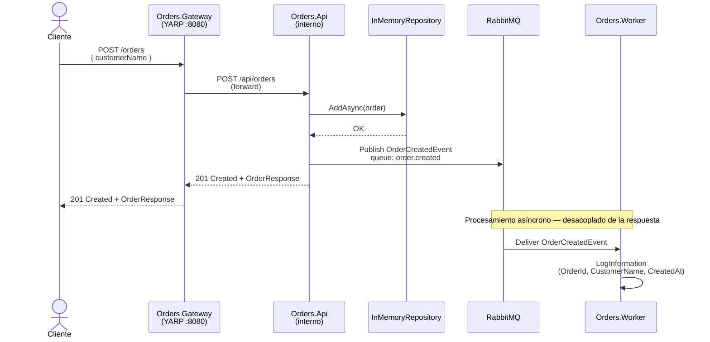

# Reto 4 — Arquitectura Distribuida de Microservicios

Sistema de órdenes evolucionado hacia una arquitectura distribuida con API Gateway, comunicación
por eventos y procesamiento asíncrono con Workers.

---

## Arquitectura

```
Cliente
  └── POST /orders
        └── Orders.Gateway (YARP — puerto 8080)
              └── Orders.Api (interno)
                    ├── Crea la orden en memoria
                    └── Publica OrderCreatedEvent
                          └── RabbitMQ
                                └── Orders.Worker
                                      └── Procesa notificación (log)
```

### Diagrama de secuencia



### Proyectos

| Proyecto | Tipo | Responsabilidad |
|---|---|---|
| `Orders.Domain` | Class Library | Entidades, Value Objects, interfaces de repositorio |
| `Orders.Application` | Class Library | Use Cases, DTOs, interfaz `IMessageBus` |
| `Orders.Infrastructure` | Class Library | `InMemoryOrderRepository`, `RabbitMqMessageBus` |
| `Orders.Contracts` | Class Library | Eventos compartidos entre servicios (`OrderCreatedEvent`) |
| `Orders.Api` | ASP.NET Core Web API | Endpoints REST, orquesta use cases, publica eventos |
| `Orders.Gateway` | ASP.NET Core + YARP | API Gateway — único punto de entrada |
| `Orders.Worker` | .NET Worker Service | Consume eventos de RabbitMQ en background |

---

## Decisiones técnicas

### YARP como API Gateway
YARP (Yet Another Reverse Proxy) es una librería de Microsoft construida sobre ASP.NET Core.
Se eligió sobre nginx porque permite configurar el routing desde `appsettings.json` y extenderlo
con middleware .NET sin salir del ecosistema. La configuración de rutas es simple y tipada.

### RabbitMQ como Message Broker
Se eligió RabbitMQ por ser el broker más usado en entornos .NET, con soporte oficial de cliente
(`RabbitMQ.Client`), Management UI incluida para observabilidad, y fácil integración en Docker.
La cola `order.created` usa `durable: true` para sobrevivir reinicios del broker.

### InMemory Repository (intencional)
El almacenamiento en memoria es una decisión consciente para este reto. El foco está en demostrar
el flujo distribuido (Gateway → API → RabbitMQ → Worker), no en la persistencia. Reemplazar
`InMemoryOrderRepository` por un repositorio con PostgreSQL o SQL Server es un cambio de
infraestructura puro que no afecta ninguna otra capa.

### Orders.Contracts como proyecto compartido
El evento `OrderCreatedEvent` vive en un proyecto separado referenciado tanto por `Orders.Api`
(producer) como por `Orders.Worker` (consumer). Esto garantiza que ambos lados usen exactamente
el mismo contrato de serialización, sin duplicar el record.

---

## Trade-offs

| Decisión | Ventaja | Costo |
|---|---|---|
| Comunicación asíncrona via RabbitMQ | El API responde inmediato, el worker procesa independiente | Mayor complejidad operacional, necesitás el broker arriba |
| InMemory storage | Sin dependencias externas, setup instantáneo | Los datos se pierden al reiniciar el contenedor |
| YARP sobre nginx | Configuración en C# / JSON, fácil de extender | Consume más memoria que nginx, menos probado en producción extrema |
| Worker como proceso separado | Escala independientemente del API, fallo aislado | Un proceso más que operar y monitorear |

---

## Requisitos

- Docker Desktop

---

## Levantar el proyecto

```bash
# Desde la raíz de reto4/
docker compose up --build
```

Servicios que levanta:

| Servicio | Puerto | Descripción |
|---|---|---|
| `orders-gateway` | `8080` | Único punto de entrada — enviá los requests acá |
| `rabbitmq` | `15672` | Management UI — usuario: `guest`, contraseña: `guest` |
| `orders-api` | interno | No expuesto al host |
| `orders-worker` | — | Background process, sin puerto |

---

## Flujo completo — demo

### 1. Crear una orden

```bash
curl -X POST http://localhost:8080/orders \
  -H "Content-Type: application/json" \
  -d '{"customerName": "Juan Perez"}'
```

Respuesta esperada:

```json
{
  "id": "3fa85f64-5717-4562-b3fc-2c963f66afa6",
  "customerName": "Juan Perez",
  "status": "Pending",
  "createdAt": "2026-04-12T00:00:00Z",
  "items": [],
  "total": 0
}
```

### 2. Verificar el evento en el Worker

En los logs del contenedor `orders-worker` vas a ver:

```
[OrderCreatedWorker] Orden recibida — Id: 3fa85f64... | Cliente: Juan Perez | Fecha: 2026-04-12
```

### 3. Agregar un ítem a la orden

```bash
curl -X POST http://localhost:8080/orders/{id}/items \
  -H "Content-Type: application/json" \
  -d '{"productName": "Laptop", "quantity": 1, "unitPrice": 2500.00}'
```

### 4. Ver todas las órdenes

```bash
curl http://localhost:8080/orders
```

### 5. Ver eventos en RabbitMQ Management UI

Abrí `http://localhost:15672` → pestaña **Queues** → cola `order.created`.

---

## Parar los contenedores

```bash
docker compose down
```
