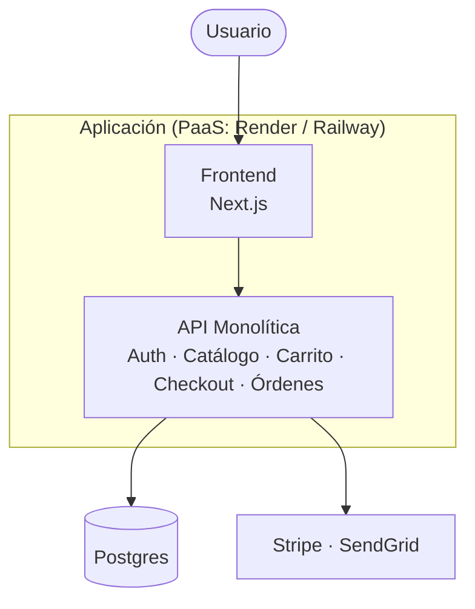
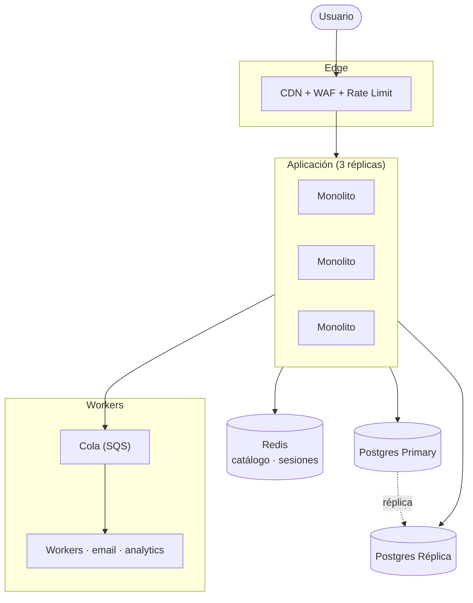
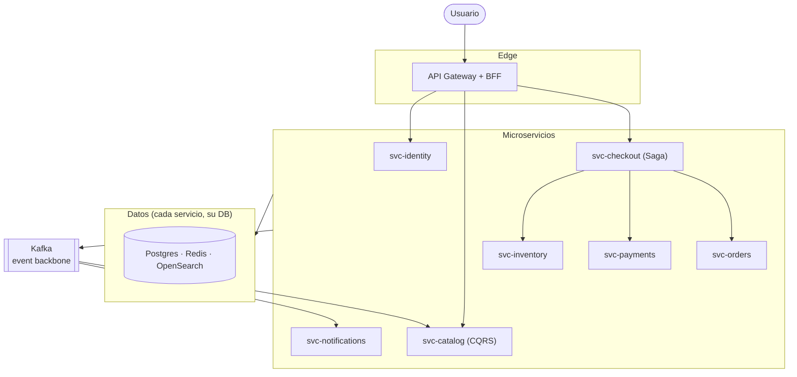
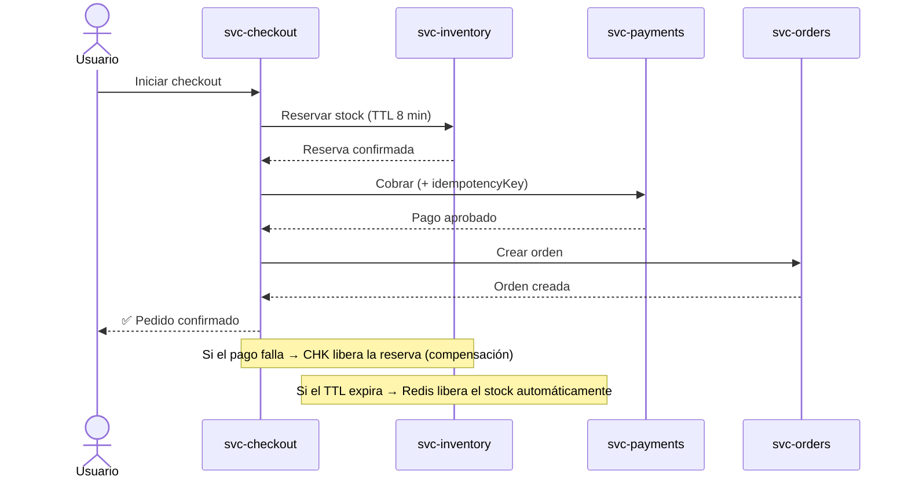
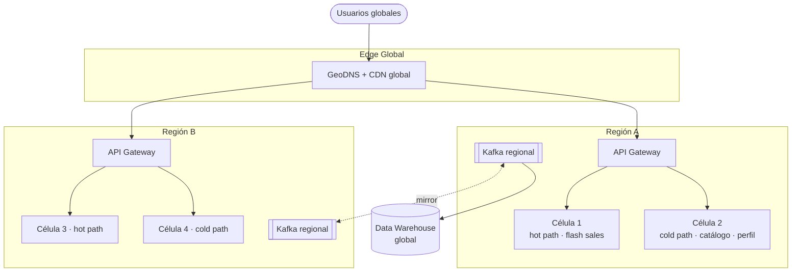
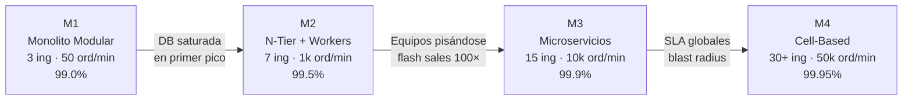

---
tags:
  - area/lite
  - tipo/nota
---

# FlashSale — Arquitectura Evolutiva (4 Momentos)

> Plataforma de ventas relámpago (10–30 min). Startup que crece de 3 a 30+ ingenieros en 18–24 meses.

---

## Estructura de cada momento

Cada etapa responde las mismas preguntas:

1. ¿Cuál es el **problema** que dispara el cambio?
2. ¿Qué **estilo arquitectónico** se elige?
3. ¿Qué **patrones** se aplican y dónde?
4. ¿Qué decisiones de **datos y resiliencia** se toman?
5. ¿Cómo se **migra** al siguiente momento sin tirar todo?

---

## Momento 1 — MVP (Mes 0–2)

### Problema principal

> [!WARNING]
> No se sabe si el producto le importa a alguien. El mayor riesgo no es la escala, es construir algo que nadie quiere.

### Estilo: Monolito Modular en Capas

Todo en una sola unidad desplegable, con separación interna estricta.

### Patrones

| Zona | Patrón |
| --- | --- |
| Aplicación | Capas (Presentation → Application → Domain → Infrastructure) |
| Aplicación | Dependency Injection, Repository, Unit of Work |
| Datos | ORM, transacciones ACID locales, migraciones versionadas |
| Resiliencia | Timeout básico en llamadas externas |
| Observabilidad | Logs a stdout, Sentry para errores |

### Decisiones de datos y resiliencia

| Decisión | Por qué |
| --- | --- |
| Postgres único, sin réplicas | Sin tráfico que justifique más |
| Stock con `SELECT FOR UPDATE` | Suficiente para 50 órdenes/min |
| Sin cola de mensajes | YAGNI — emails van síncronos |
| Sin cache | YAGNI — primero medimos |

> [!CAUTION]
> **Deuda consciente asumida**: una caída tira todo, sin cache las flash sales queman la DB, los emails lentos bloquean el checkout. Se acepta porque el riesgo real aún es no validar el producto.

### Migración a M2 (sin big-bang)

| Paso | Cómo |
| --- | --- |
| 1. Contenerizar | Dockerfile multi-stage — el código no cambia |
| 2. Agregar load balancer | 2–3 réplicas detrás de un ALB |
| 3. Emails a cola | **Branch-by-abstraction**: interfaz `INotifier` + feature flag |
| 4. Redis para cache | Decorator en el repositorio de catálogo |
| 5. CDN delante | Cambio de DNS, cero código |

---

## Momento 2 — Monolito Endurecido (Mes 3–6)

### Problema principal

> [!WARNING]
> La primera flash sale real rompió el MVP. La base de datos se ahogó, una caída tiró todo el sitio, los emails colapsaron el checkout.

### Estilo: N-Tier Distribuido + Worker Tier

El monolito se replica. Aparece una capa de workers asíncronos y una capa de cache.

### Patrones

| Zona | Patrón |
| --- | --- |
| Edge | CDN, WAF, Rate Limiting |
| Aplicación | Stateless replicas, Health Probes, Graceful Shutdown |
| Datos | **Cache-Aside**, **Read/Write Splitting** |
| Asíncrono | Producer/Consumer, Competing Consumers, **Idempotent Consumer** |
| Resiliencia | **Circuit Breaker**, **Retry con backoff**, **Bulkhead**, **Outbox** embrionario |
| Observabilidad | Métricas RED, Logs con `correlation-id`, Alertas básicas |

### Decisiones de datos y resiliencia

| Decisión | Por qué |
| --- | --- |
| Postgres Primary + Read Replica | Lecturas calientes ahogaban los writes |
| Redis para cache + sesiones | Réplicas stateless, latencia de catálogo 80ms → 3ms |
| Cola para emails / webhooks | Saca procesos lentos de la ruta crítica |
| Circuit Breaker en Stripe / SendGrid | Una caída externa no tira el sitio |
| Multi-AZ en Postgres y Redis | Alta disponibilidad, RPO < 5 min |

### Migración a M3 (sin big-bang)

| Paso | Cómo |
| --- | --- |
| 1. Definir bounded contexts | Event Storming con el equipo de producto |
| 2. Introducir API Gateway | El monolito queda detrás — el gateway es el nuevo punto de entrada |
| 3. Extraer `svc-notifications` | El de menor riesgo — ya consume la cola de M2 |
| 4. Extraer `svc-inventory` | **Dual-write + shadow reads** por 2 semanas hasta paridad |
| 5. Incorporar Kafka | El monolito publica eventos por CDC desde la outbox |
| 6. Extraer los demás | Sprint a sprint — cada extracción es PR de eliminación neta |

> [!TIP]
> **Strangler Fig**: se construye lo nuevo al lado, el tráfico se redirige gradualmente. Solo cuando hay paridad medida durante días, se corta lo viejo.

---

## Momento 3 — Microservicios por Bounded Context (Mes 6–12)

### Problema principal

> [!WARNING]
> El monolito ya no es el cuello técnico, es el cuello organizacional. Tres equipos pisándose en el mismo repo. Un bug en pagos puede tirar catálogo.

### Estilo: Microservicios + Event-Driven Architecture

Un servicio = un equipo = un repo = una base de datos = un pipeline.

### Patrones

| Zona | Patrón |
| --- | --- |
| Edge | API Gateway, **BFF por canal** (web / mobile) |
| Aplicación | **Saga orquestada** (checkout), DDD, Anti-Corruption Layer |
| Datos | **Database per Service**, **CQRS** (catálogo), **Outbox + CDC**, **Schema Registry** |
| Asíncrono | Kafka, Pub/Sub, **Event Versioning**, **Idempotency Keys**, Dead Letter Topics |
| Resiliencia | **Bulkhead**, Circuit Breaker, **Saga compensaciones**, **Retry + DLQ** |
| Observabilidad | **OpenTelemetry** (traces, métricas, logs), **SLOs por servicio**, Dashboards RED |
| Operación | Kubernetes, HPA, **Canary deploys**, **GitOps** (ArgoCD), Service Mesh |

### Decisiones de datos y resiliencia

| Decisión | Por qué |
| --- | --- |
| Database per service | Ningún servicio lee la DB de otro. Autonomía total |
| Redis + reservas atómicas con TTL en inventario | Lock contention en Postgres no escala a 50k ord/min |
| CQRS en catálogo (writes Postgres → reads OpenSearch) | Lecturas son 100× las escrituras |
| Saga orquestada en checkout | Transacciones distribuidas sin 2PC ni locks |
| Outbox + Debezium | Garantiza publicación de eventos si y solo si commitea la transacción |

### Checkout: flujo de la Saga

### Migración a M4 (sin big-bang)

| Paso | Cómo |
| --- | --- |
| 1. Identificar hot path vs cold path | Análisis de carga real por servicio/endpoint |
| 2. Definir el concepto de "célula" | Stack completo aislado para un subconjunto de usuarios |
| 3. Levantar una célula piloto | Mismo código, namespace separado, datos aislados |
| 4. Roll-out por célula | 1% → 10% → 50% → 100% con rollback automático por SLO |
| 5. Extender a segunda región | Activa-pasiva primero, luego activa-activa |

---

## Momento 4 — Cell-Based + Multi-Región (Mes 12–24)

### Problema principal

> [!WARNING]
> Los modos de falla ya no son individuales, son sistémicos. Una flash sale viral colapsa la región completa. SLA contractuales de 99.95%.

### Estilo: Cell-Based Architecture + Multi-Región

Cada célula es un stack completo aislado. La falla de una célula afecta a una minoría predecible de usuarios.

### Patrones

| Zona | Patrón |
| --- | --- |
| Edge | **GeoDNS**, **Edge Compute**, Multi-CDN failover |
| Aplicación | **Cell isolation**, **Shuffle sharding**, Hot/Cold path separation |
| Datos | Sharding por célula, Read replicas multi-región, Active-Active / Active-Passive según criticidad |
| Asíncrono | **Event Mesh** global, Kafka MirrorMaker, Schema Registry versionado |
| Resiliencia | **Cell failover automático**, **Chaos engineering** continuo, Load shedding en edge |
| Observabilidad | SLOs multi-nivel (servicio · célula · región), Anomaly detection, Continuous profiling |
| Operación | GitOps multi-cluster, **Progressive delivery**, FinOps integrado |

### Decisiones de datos y resiliencia

| Decisión | Por qué |
| --- | --- |
| Cell isolation | Blast radius contenido — la falla de una célula no afecta a las demás |
| Shuffle sharding | Probabilidad casi nula de que dos clientes ruidosos compartan célula |
| Active-Active en lecturas | Latencia regional óptima |
| Active-Passive en escrituras críticas | Single source of truth (pagos, órdenes), failover < 60s |
| Chaos engineering continuo | El sistema se prueba en su modo real, no en staging |

---

## Resumen de la evolución

| | M1 | M2 | M3 | M4 |
| --- | --- | --- | --- | --- |
| **Estilo** | Monolito modular | N-Tier + Worker Tier | Microservicios + Event-Driven | Cell-Based + Multi-Región |
| **Datos** | Postgres único | Primary + Réplica + Redis | DB per service | Sharding + multi-región |
| **Comunicación** | In-process | HTTP + Cola | Kafka + HTTP (sagas) | Event Mesh |
| **Resiliencia** | Timeouts | Circuit Breaker + Retry | Sagas + Bulkhead + DLQ | Cell isolation + Chaos |
| **Deploy** | App entera | App replicada | Por servicio | Por célula |
| **Equipo** | 3 | 5–8 | 8–15 | 30+ |
| **SLA** | 99.0% | 99.5% | 99.9% | 99.95% |

---

## Los 5 patrones de migración (sin big-bang)

> [!TIP]
> Toda la evolución se sostiene con estos cinco patrones. Internalizarlos evita cualquier big-bang.

| Patrón | Cuándo usarlo | Ejemplo en este reto |
| --- | --- | --- |
| **Branch-by-Abstraction** | Cambiar una implementación interna sin tocar callers | Emails síncronos → cola (M1→M2) |
| **Strangler Fig** | Reemplazar un sistema completo gradualmente | Extraer servicios del monolito (M2→M3) |
| **Dual-Write + Shadow Reads** | Migrar un store de datos crítico | `svc-inventory` saliendo del monolito (M3) |
| **Feature Flags + Canary** | Activar comportamiento nuevo de forma reversible | Cualquier feature en M2/M3/M4 |
| **Cell Migration** | Mover usuarios entre stacks aislados | Roll-out célula por célula (M3→M4) |

---

## Ver también

- [[reto1-simplificado]]
- [[reto1]]
- [[ARQUITECTURA]]
- [[arquitectura-vs-patrones]]
- [[microservices]]
